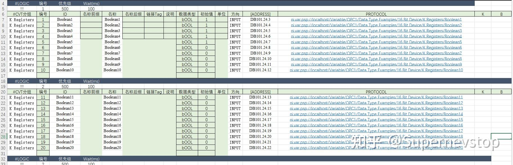
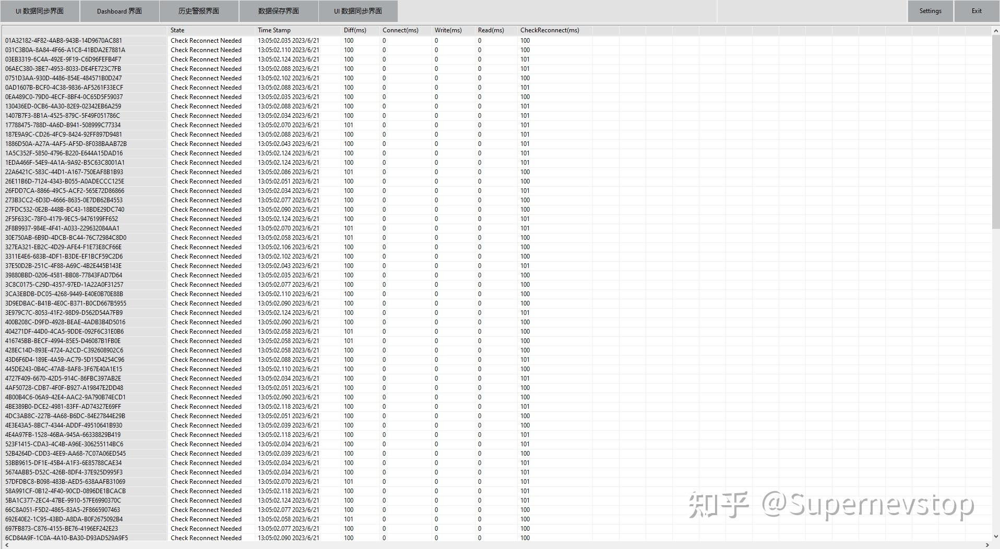
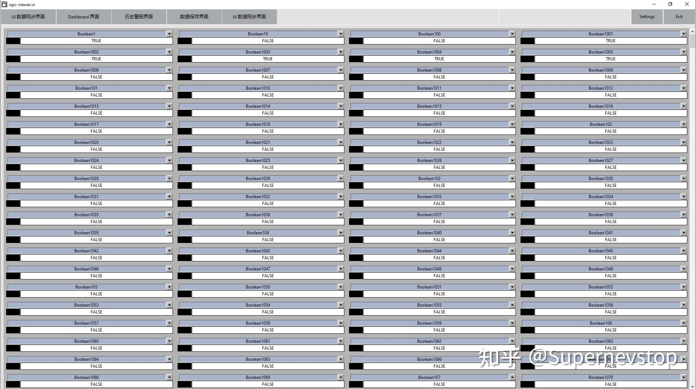

> 本文整理自知乎回答，并按站点文档风格进行结构化排版。
> [原文链接](https://www.zhihu.com/question/607232707/answer/3083563111)

当 PLC 变量数量上升到几千点时，很多“小系统里还凑合”的做法会迅速失效。原回答里给出的是一套偏工程化的落地思路，重点不是单个驱动 API 怎么调用，而是如何把海量变量的连接、调度、展示和告警拆成可维护的层次。

## 目标场景

这套方案面对的是“大量 PLC 点位 + 实时刷新 + 长时间稳定运行”的组合场景。原回答给出的实测规模是：

- 2500+ PLC 数据点。
- 约 150 个分组。
- 100 ms 刷新一次。

在这个量级下，核心问题通常不再是“能不能读到数据”，而是“如何长期稳定、可维护地读到数据”。

## 整体思路

原回答把方案拆成 5 个关键点：

1. 通过 `Datasocket` 进行 PLC 变量通讯，而不是直接依赖网络共享变量绑定。
2. 使用 Excel 管理 PLC 变量分组、地址、URL 和 Alarm 配置。
3. 每个分组独立循环运行，内部采用状态机调度读写逻辑。
4. 所有硬件操作、界面显示、报警与保存逻辑都通过数据中间层交互。
5. 界面层通过 VIScript 自动把前面板控件和数据中间层同步刷新，只要求数据 ID 一致。

这几条放在一起看，实际上是在回答一个更大的问题：**如何让“PLC 接入”不把整个应用拖成一团。**

## 为什么不直接绑网络共享变量

原回答的第一条就明确绕开了网络共享变量绑定，这背后的取舍很清楚：点位一多，直接绑定虽然上手快，但后续在分组调度、重连控制、异常隔离和配置管理上都会变得比较被动。

改成 Datasocket + 自己的调度层之后，系统可以更明确地控制：

- 哪些点位属于同一个刷新分组。
- 哪个分组需要独立重连。
- 哪些异常只影响局部，而不是拖垮全局。

## Excel 配置层的作用

当变量规模到几千点时，配置不可能靠手工散落在 block diagram 里维护。原回答采用 Excel 来管理：

- PLC 地址。
- URL。
- 分组信息。
- Alarm 配置。

它的价值不是“Excel 方便编辑”这么简单，而是把通讯配置从程序逻辑里抽离出来，让批量调整、导入和核对都更容易做。

## 调度层设计

每个分组独立循环运行，循环内部再用状态机处理读写和异常，是这套方案能扩展到更大规模的关键。

原回答特别提到一个细节：如果某个分组里有异常 PLC 变量，需要做的是**只重连异常变量**，而不是整套系统一起重连。这个边界一旦划清，系统在局部故障下的稳定性会明显提高。

## 数据中间层与界面解耦

原回答中另一个值得保留的点，是“所有数据架设数据中间层”。也就是：

- 硬件操作不直接驱动界面。
- 界面、告警、保存逻辑不直接碰硬件。
- 它们都只和统一的数据中间层交互。

这会让后续扩展变得容易很多，比如新增历史记录、报警策略、报表导出时，不需要反复回到 PLC 通讯循环里改逻辑。

## 界面刷新策略

在界面层，原回答采用 VIScript 自动同步前面板控件和数据中间层，只要控件 ID 与数据 ID 对应即可。这种做法对大量变量场景很重要，因为它能减少大量手工绑定和重复界面代码。

## 当前状态与后续方向

原回答最后也明确说明，这套系统当时还在继续打磨中，后续还要做的包括：

- 细节优化。
- API 对外释放。
- 进一步整理成更完整的可复用接口。

这点很重要，因为它说明这不是一个“理论架构图”，而是一个已经跑过真实规模、但仍在继续工程化的方案。

## 小结

面对成千上万的 PLC 变量，真正有效的通常不是某一个更快的读写 VI，而是一整套分层方法：配置层、调度层、数据中间层和界面层各自分责，局部异常局部恢复。原回答里这套 2500+ 点位方案的价值，正在于它把这些边界划清了。
