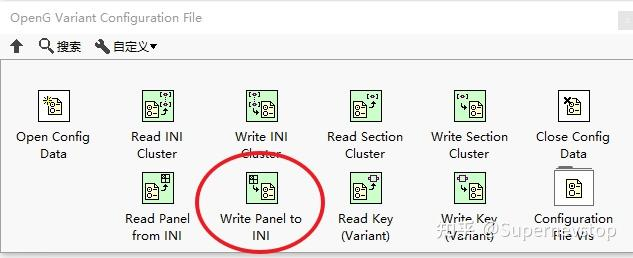
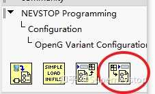

> 本文整理自知乎回答，并按站点文档风格进行结构化排版。
> [原文链接](https://www.zhihu.com/question/616130700/answer/3155730536)

当前面板上挂了大量数值、文本和布尔控件时，手工逐个把状态写进 INI 基本不可维护。这个回答给出的方向很直接：先用成熟工具把“批量保存”这件事做起来，再根据项目需要补一个更贴近真实使用场景的变体。

## 直接可用的基础方案

原回答首先推荐的是 OpenG 提供的 `Write Panel to INI`。它适合快速解决下面这类问题：

- 控件很多，不想逐个写配置映射。
- 希望把整块前面板状态一次性持久化。
- 想优先用现成工具，而不是从零自己造轮子。

这类方案的价值在于，它把“面板状态持久化”从一堆重复机械代码，变成了可以直接复用的基础能力。

## 这个方案的一个典型限制

原回答同时指出了一个很实际的问题：`Write Panel to INI` 会把 `Control` 和 `Indicator` 一起保存。

在很多项目里，这并不是理想结果。因为真正需要持久化的通常是用户输入或可配置状态，而不是运行过程中的显示值。如果把 Indicator 也一起写进 INI，配置文件就容易混入大量运行态信息。

## 更贴近工程落地的变体

因此，原回答里提到在自己维护的库中补了一个只保存 `Control` 的 VI。这个思路的价值在于：

- 只保留真正需要恢复的配置输入。
- 避免把界面显示结果写回配置层。
- 让 INI 文件更像配置资产，而不是界面快照。

相关仓库：

- [NEVSTOP-Programming-Palette](https://github.com/NEVSTOP-LAB/NEVSTOP-Programming-Palette)

原回答提到的 VI 位于该仓库配置相关目录中，并依赖 OpenG Variant Configuration File Library。

## 什么时候该选哪一种

可以用一个很简单的标准来判断：

- 如果只是想快速保存整块前面板状态，直接用 OpenG 的 `Write Panel to INI`。
- 如果更关注“配置输入”和“运行显示”的边界，就更适合只保存 `Control` 的变体方案。

## 小结

这个问题的关键不在于有没有现成 API，而在于你希望 INI 承担什么角色。OpenG 的方案适合快速起步，而只保存 `Control` 的改进版本，更接近真实项目里对配置边界的要求。
