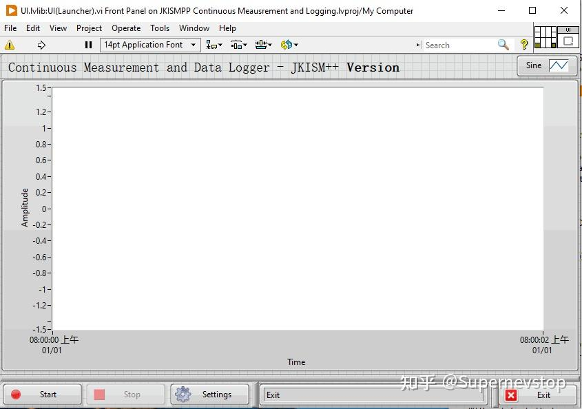
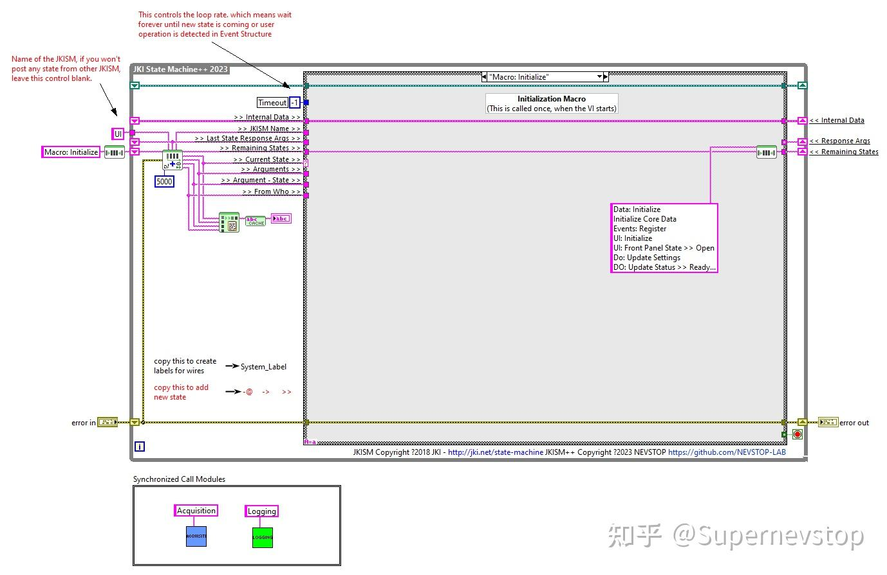
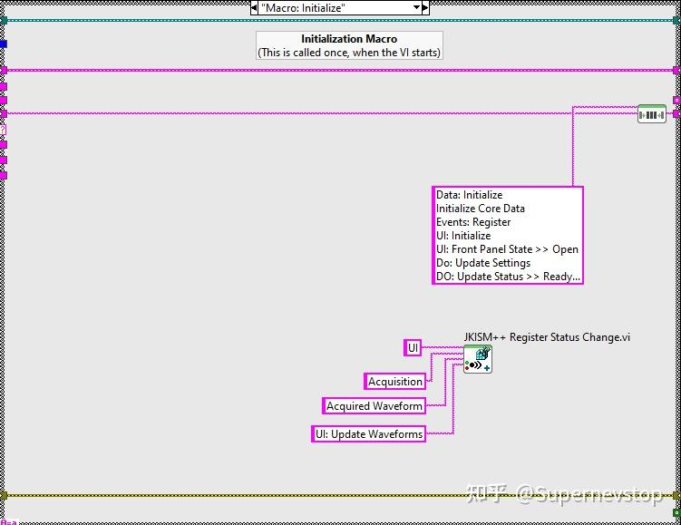
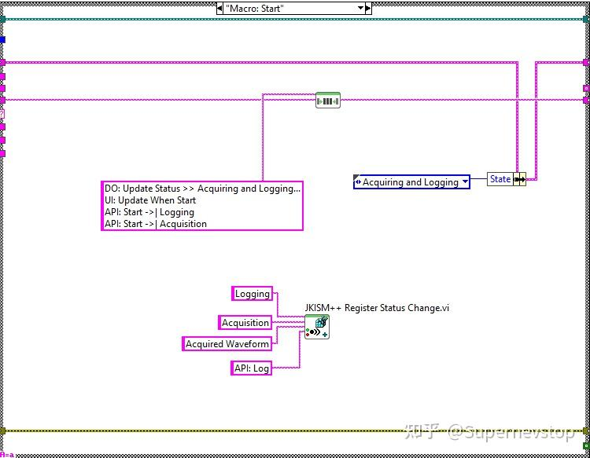
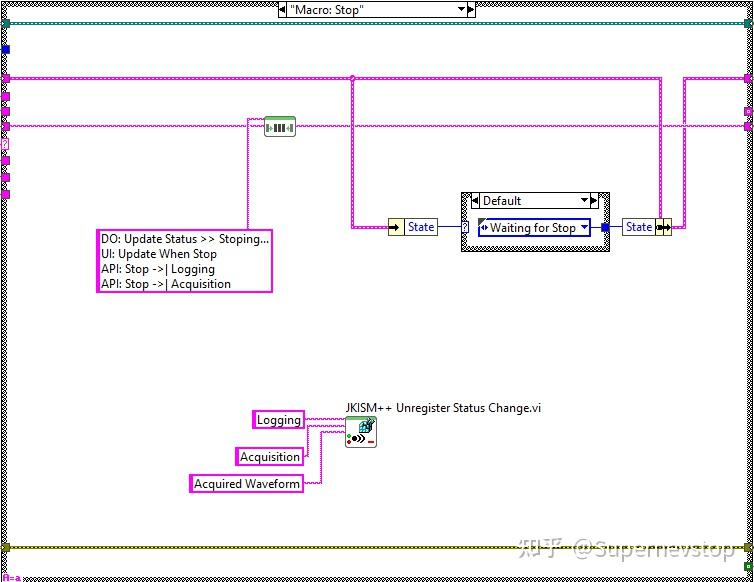

> 本文整理自知乎专栏原文，并按站点文档风格进行结构化排版。
> [原文链接](https://zhuanlan.zhihu.com/p/655192968)

这篇示例文章展示了 CSM 在“连续测量 + 数据记录”这类经典 LabVIEW 场景中的模块化拆分方式。核心目标不是做一个固定的采集程序，而是做出一个可以轻松替换底层采集模块的模板。

相关链接：

- [项目仓库](https://github.com/NEVSTOP-LAB/CSM-Continuous-Meausrement-and-Logging)
- [VIPM 包下载](https://www.vipm.io/package/nevstop_lib_csm_continuous_meausrement_and_logging_example/)

## 模块划分

原文把整个示例拆成 3 个关键角色：

- `Logging Module`：负责把 1D 波形数据写入 TDMS。
- `Acquisition Module`：负责生成模拟数据，或在实际项目中替换为真实硬件采集模块。
- `UI Module`：既承担界面展示，也承担控制与调度职责。

这种拆分的关键在于：`Logging` 和 `Acquisition` 彼此不需要了解对方内部实现，只需要暴露统一的 API 和状态接口。这样一来，后续要换硬件模块时，只要保持接口一致，就能替换而不改 UI 主逻辑。

## 底层模块接口示例

### Logging Module

原文给出的调用方式示例如下：

```text
API: Update Settings >> c:\_data -> Logging
API: Log >> MassData-Start:89012,Size:1156 -> Logging
API: Start -> Logging
API: Stop -> Logging
```

### Acquisition Module

```text
API: Start -> Acquisition
API: Stop -> Acquisition
```

只要真实硬件采集模块继续提供一致的 API 与状态，UI 层就不需要知道底层是模拟源、DAQ，还是其他设备。

## UI 模块如何组织整体流程

原文采用了一个很典型的 CSM 做法：把 UI 模块同时作为 Controller，负责调度子模块之间的协作。



在块图层面，`Logging Module` 与 `Acquisition Module` 作为子模块挂在 UI 模块后面，从而形成一个由 UI 驱动的组合应用。



## 启动过程

启动阶段的主要任务包括：

- 初始化数据与界面。
- 从 XML 加载配置。
- 将配置下发给子模块。
- 把 `Acquisition` 模块的 `Acquired Waveform` 状态注册到 `UI: Update Waveforms`。

原文中的初始化宏大致如下：

```text
Data: Initialize
Initialize Core Data
Events: Register
UI: Initialize
UI: Front Panel State >> Open
Do: Update Settings
DO: Update Status >> Ready...
```



## 开始采集与记录

进入采集阶段后，UI 会做两件重要的事：

1. 更新界面状态。
2. 把 `Acquisition` 的 `Acquired Waveform` 状态注册到 `Logging` 模块的 `API: Log`。

这样一来，采集模块一旦产生波形状态，记录模块就会自动触发写盘，无需让两者直接互相调用。

```text
DO: Update Status >> Acquiring and Logging...
UI: Update When Start
API: Start ->| Logging
API: Start ->| Acquisition
```



## 停止与退出

停止采集时，UI 会更新界面并停止子模块，同时取消相关状态订阅；退出阶段则关闭子模块、界面和事件注册。

```text
DO: Update Status >> Stoping...
UI: Update When Stop
API: Stop ->| Logging
API: Stop ->| Acquisition
```

```text
Macro: Exit -@ Acquisition
Macro: Exit -@ Logging
UI: Front Panel State >> Close
Data: Cleanup
Events: Unregister
Exits
```



## 这个示例最值得学的点

这篇文章真正展示的，不只是“连续记录应用怎么写”，而是 CSM 如何通过统一 API 与状态接口，把多个互不耦合的模块组装成完整应用。采集源可以替换，记录实现可以替换，UI 仍然只需要围绕接口做编排。

对于需要长期演进的测量系统，这种能力比单次做出一个能跑的范例更重要。
