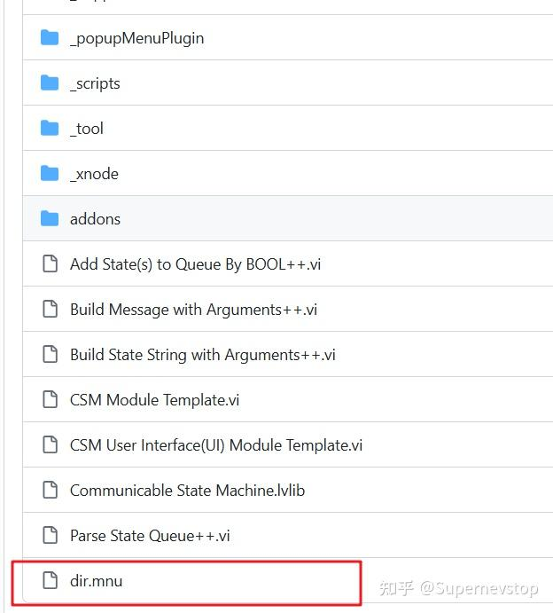

> 本文整理自知乎回答，并按站点文档风格进行结构化排版。
> [原文链接](https://www.zhihu.com/question/663966485/answer/3594611299)

LabVIEW 用户库里函数面板显示问号，很多时候不是某个 VI 本身有问题，而是 palette 或 mnu 的发布链路没有处理好。原回答给出的两条路径都很实用，本质上是在回答：你是想把 palette 交给 VIPM 管，还是想自己完全掌控 mnu 文件。

## 方案一：使用 VIPM 的 Palette 功能

第一条路径是优先使用 VIPM 自带的 Palette 管理能力。它的优势在于：

- 不需要手工编辑 mnu 文件。
- 在打包 VIP 时，只要把函数 palette 配好，VIPM 会自动生成对应的 mnu。
- 安装时会把生成结果放到正确的位置。

这条路径更适合下面这些情况：

- 你已经在用 VIPM 管理工具分发。
- 希望 palette 的生成和安装一起自动化。
- 不想把太多精力花在 mnu 格式和路径细节上。

参考仓库：

- [NEVSTOP-Programming-Palette](https://github.com/NEVSTOP-LAB/NEVSTOP-Programming-Palette)

## 方案二：手工维护 mnu 文件

第二条路径是自己编辑 mnu：

1. 在 `Tools >> Advanced >> Edit Palette Set...` 中创建新的 palette 入口。
2. 手工加入对应的 LabVIEW VI API。
3. 将编辑后的 mnu 文件保存到代码目录。
4. 打包 VIPM 时，把 mnu 文件和对应 VI 一起打进去。

这条路径的关键不是“能不能编辑出来”，而是**路径关系必须稳定**。原回答特别提醒：mnu 文件保存的是相对路径，所以打包时必须保证 mnu 和实际 VI 的相对目录结构不被破坏。

## 什么时候选哪条路径

可以这样区分：

- 如果目标是降低维护成本，优先选 VIPM Palette。
- 如果需要完全控制菜单结构、安装内容和路径关系，选手工 mnu。

原回答里还提到，CSM 的几个相关仓库更常使用第二种方式，也就是自己维护 mnu，再连同 API 一起打包。

相关示例仓库：

- [Communicable-State-Machine](https://github.com/NEVSTOP-LAB/Communicable-State-Machine)

## 小结

函数面板显示问号，很多时候不是 LabVIEW 识别不了你的 VI，而是 palette 发布链路没有走完整。VIPM Palette 更省心，手工 mnu 更可控；项目简单时前者更省力，开始维护自己的工具生态后，后者会给你更大的掌控力。
