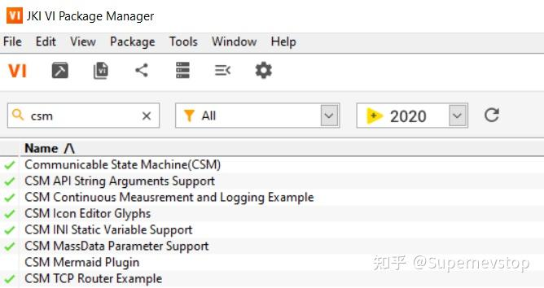

> 本文整理自知乎专栏原文，并按站点文档风格进行结构化排版。
> [原文链接](https://zhuanlan.zhihu.com/p/9441493751)

这篇文章本质上是一份 CSM 生态入口导航。随着仓库、文章、视频和 VIPM 包逐渐增多，维护一页统一入口会比零散收藏链接更有效。

## CSM 是什么

CSM 是一个基于 JKI State Machine 思路扩展而来的 LabVIEW 应用框架，重点补充了模块间通信所需的同步消息、异步消息、状态订阅/取消订阅等机制，从而更适合构建可复用模块与大型应用。

如果你想先看它与 JKISM 的差异，可以继续读这篇对照说明：

- [大家来找茬游戏：CSM vs JKISM](/blog/2024-12-30-csm-vs-jkism-template-diff/)

## CSM VIPM Libraries 用途说明

目前生态里最核心的几个包可以这样理解：

1. `Communicable State Machine (CSM)`：核心框架，提供同步消息、异步消息、状态订阅等基础能力。
2. `CSM API String Arguments Support`：面向外部接口的参数传递层，强调可读、可手工输入、可覆盖多种参数类型。
3. `CSM MassData Arguments Support`：为数组、波形等大数据量消息提供更高效的传递方式。
4. `CSM INI Variable Support`：把 INI 配置映射成 CSM 可直接访问的变量，适合配置密集型系统。
5. `CSM Icon Editor Glyphs`：补充一组图标元素，方便统一 CSM 模块视觉风格。
6. `CSM Mermaid Plugin`：借助 Mermaid 对模块关系做可视化展示。

## 源码与下载途径

常用入口如下：

- [GitHub 组织主页](https://github.com/NEVSTOP-LAB?view_as=public)
- [Gitee 组织主页](https://gitee.com/NEVSTOP-LAB)
- [VIPM 包列表](https://www.vipm.io/package-list/a47d63f3-574b-4d80-99b1-c75961e5944c/)
- VIPC 离线包合集：百度网盘链接见原文页中的同步说明

如果你的网络环境对 GitHub 访问不稳定，原文也给出了若干第三方加速与镜像建议。站内这里保留主入口，细节建议以实际网络环境为准。

## 线上资料

想系统了解 CSM，可以从这些资料开始：

- CSM README：
  [GitHub 英文版](https://github.com/NEVSTOP-LAB/Communicable-State-Machine/blob/main/README.md)、[GitHub 中文版](https://github.com/NEVSTOP-LAB/Communicable-State-Machine/blob/main/README(zh-cn).md)
- [CSM Wiki](https://github.com/NEVSTOP-LAB/CSM-Wiki)
- [CSM 讲演资料集合](https://github.com/NEVSTOP-LAB/csm-keynotes-collection)

## 应用场景与示例

如果你更关心“CSM 能落到什么项目里”，可以优先看这些内容：

- [CSM 架构框架优势实例分析](/blog/2025-08-23-csm-architecture-advantages/)
- [CSM 示例：TCP 通讯应用](/blog/2025-06-27-csm-tcp-router-example/)
- [CSM-Module：文件同步备份模块](/blog/2025-06-10-csm-filesync-module/)
- [GitHub 上带有 labview-csm topic 的仓库](https://github.com/search?q=topic%3Alabview-csm&type=repositories)

## 社区资源

原文里还整理了两类很有价值的社区内容。

### 学习应用系列

- [学习应用篇 - 初识 CSM](https://zhuanlan.zhihu.com/p/716775042)
- [学习应用篇 - 设计 CSM 模块的正确姿势](https://zhuanlan.zhihu.com/p/836788157)
- [学习应用篇 - CSM 超强通讯支撑之 API String](https://zhuanlan.zhihu.com/p/3409042150)
- [学习应用篇 - CSM 大数据高效传输之 MassData Support](https://zhuanlan.zhihu.com/p/8643371771)
- [学习应用篇 - 典型场景下 CSM 的消息传递实现 - 同步/异步消息（1/2）](https://zhuanlan.zhihu.com/p/11399684957)
- [学习应用篇 - 典型场景下 CSM 的消息传递实现 - 消息订阅（2/2）](https://zhuanlan.zhihu.com/p/17348325353)
- [学习应用篇 - CSM 内部参数管理工具之 INI Variable Support（基础篇）](https://zhuanlan.zhihu.com/p/966345515)
- [学习应用篇 - CSM 内部参数管理工具之 INI Variable Support（进阶篇）](https://zhuanlan.zhihu.com/p/1944814193485285070)

### 视频资源

- [合集·LabVIEW_CSM 框架系列](https://space.bilibili.com/360279302/channel/collectiondetail?sid=4491269&spm_id_from=333.788.0.0)

## 鸣谢

原文列出了社区贡献者与反馈者名单。这里保留主要入口：

- [Communicable-State-Machine 贡献说明](https://github.com/NEVSTOP-LAB/Communicable-State-Machine/blob/main/CONTRIBUTING(zh-cn).md)

如果你正在基于 CSM 做应用、模块或教程，最直接的参与方式仍然是：提交 issue、提交 PR，或者把你的实践案例发布出来。
