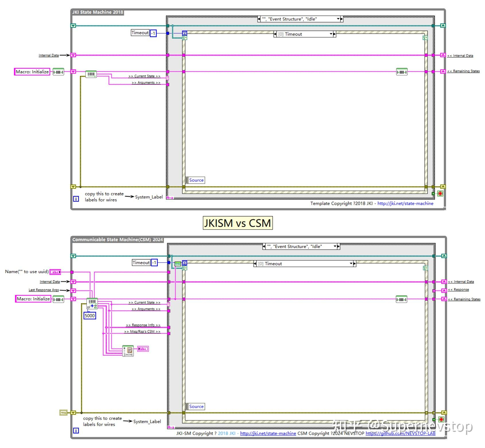

> 本文整理自知乎专栏原文，并按站点文档风格进行结构化排版。
> [原文链接](https://zhuanlan.zhihu.com/p/15449387877)

这是一篇很短、但很适合作为入门观察点的文章。原文用“找茬游戏”的方式，把 CSM 模板和 JKISM 模板摆在一起，让读者一眼看出两者差别到底落在哪些工程细节上。

## 差异点列表

原文给出的答案可以整理为 10 个点：

1. CSM 需要通过 `Name("" to use uuid)` 定义模块名称。
2. CSM 用 `Parse State Queue++.vi` 取代了 `Parse State Queue.vi`，框架处理逻辑集中在增强版实现中。
3. CSM 增加了 `Response` 反馈节点，因此同步和异步消息都可以携带返回值。
4. `Parse State Queue++.vi` 新增 `Response Info` 节点，用于在处理响应时携带更多参数。
5. `Parse State Queue++.vi` 新增 `Msg/Rsp CSM` 节点，用于在消息和响应处理中识别来源模块。
6. `Timeout` 分支多了 `Timeout Selector`，用来处理队列残余消息导致的 Idle 进入时机问题。
7. 模板增加了调试 VI，用于记录状态变化历史，便于调试。
8. 初始化阶段引入了 Error 移位寄存器。
9. 模板的版权信息更新为 NEVSTOP-LAB。
10. 图中看不到的部分也有差异，例如事件结构和条件结构与 JKISM 大体一致，但并非完全相同。

## 这些差异意味着什么

如果只把它看成“模板长得不一样”，这篇文章的价值就被低估了。更关键的是，差异背后反映了 CSM 在几个方向上的明确取舍：

- 从“单模块状态机模板”进一步走向“可通讯模块模板”。
- 把返回值和来源模块信息纳入框架层，而不是交给调用者自己约定。
- 强化调试与错误追踪能力，减少大型项目里排查状态流转问题的成本。

## 适合怎么使用这篇文章

如果你已经熟悉 JKISM，这篇文章适合作为快速迁移认知的对照表；如果你还不熟悉 JKISM，它也能帮助你理解 CSM 为什么没有停留在“只增加几条消息语法”这个层面，而是连模板骨架都一起扩展了。

更完整的背景说明可以继续看：

- [CSM 架构框架优势实例分析](/blog/2025-08-23-csm-architecture-advantages/)
- [可通讯状态机（CSM）框架资源导航](/blog/2024-11-27-csm-resource-navigation/)
