> 本文整理自知乎专栏原文，并将图片等资源本地化以便站内稳定访问。
> 原文链接：https://zhuanlan.zhihu.com/p/24096725354

DeepSeek 火起来之后，我做了一个很直接的实验：不先聊概念，而是把一个真实的 LabVIEW CSM 程序运行日志交给模型，看看它能不能反推出程序结构、模块关系和关键设计思路。本文按准备工作、三轮实验和最终结论，整理这次尝试中真正值得保留下来的部分。

## 一、准备工作

开始实验前，需要先把对话环境搭起来，并准备一份能够完整反映程序运行过程的日志样本。

### 工具与服务

- Cherry Studio：用于管理模型和日常问答交互，下载地址为 https://docs.cherry-ai.com/cherrystudio/download
- 硅基流动：可作为相对稳定的 DeepSeek API 服务入口，官网为 https://cloud.siliconflow.cn/

注册服务后，把 API 密钥填写到 Cherry Studio 的模型设置里，先做一次连通性检查，确认调用链路可用。

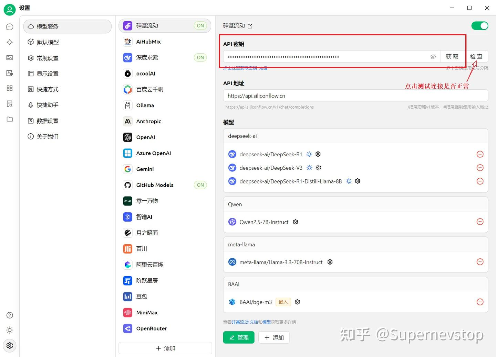

我当时使用的是第三方提供的 DeepSeek-R1 满血模型服务。也可以直接使用 DeepSeek 官方接口，但在当时的体验里，官方服务连续追问时稳定性不够理想，所以后来切换到了更稳定的中转服务。

当模型可正常切换、对话可连续进行后，准备阶段就算完成了。

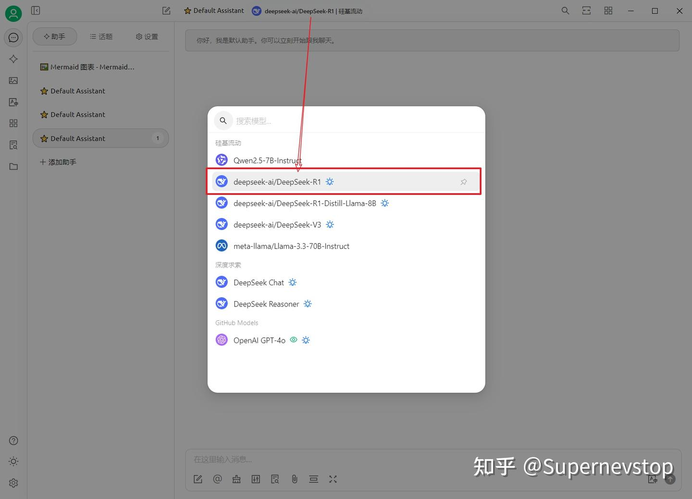

## 二、为什么 CSM 日志适合让 DeepSeek 分析

这次实验之所以可行，关键不在于 LabVIEW 本身，而在于 CSM 框架已经具备较完整的日志能力。程序运行时的模块启动、消息流转、状态变更和执行过程，都可以被记录下来。

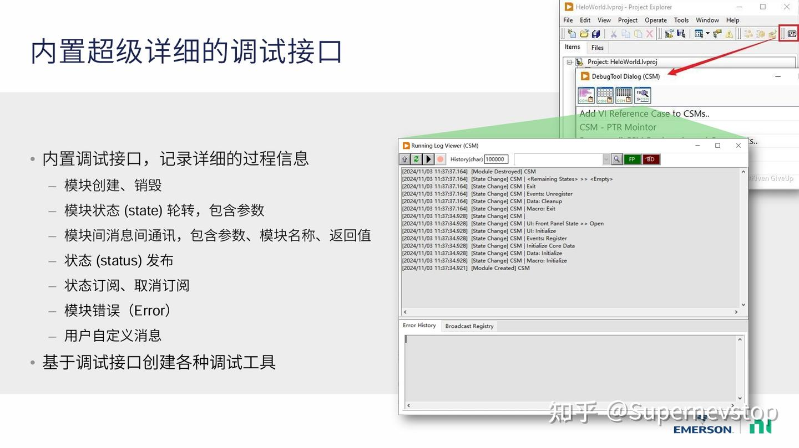

在 CSM 程序启动前加入 CSM - Start File Logger.vi，就可以把完整运行过程保存为 csmlog 文件，同时还能配置日志大小限制和过滤规则。这样一来，原本只能靠人工阅读框图才能理解的运行细节，就被转换成了模型可以处理的文本材料。

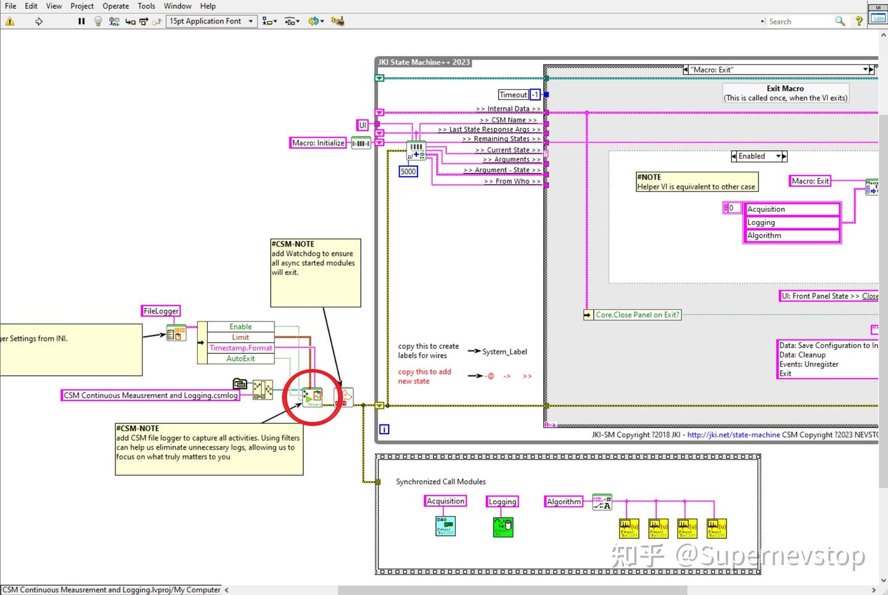

这也是本文的核心假设：如果日志足够完整，DeepSeek 就有机会帮助我们补全程序结构认知，甚至反向整理流程图、订阅图和模块关系图。这个假设是否成立，可以用三轮实验直接验证。

## 三、三轮实验记录

本次使用的日志来自《CSM 示例：连续测量和记录应用程序》对应的运行过程，原始示例可参考：https://zhuanlan.zhihu.com/p/655192968 。我先启动程序、配置波形、运行一段时间后停止，再关闭程序，得到一份完整日志文件作为实验输入。

### 尝试 1：只给日志，不补充框架背景

第一轮最朴素，直接把日志交给 DeepSeek，不额外解释它来自什么框架、遵循什么语法。

随后可以看到模型给出的思考过程和回答结果。

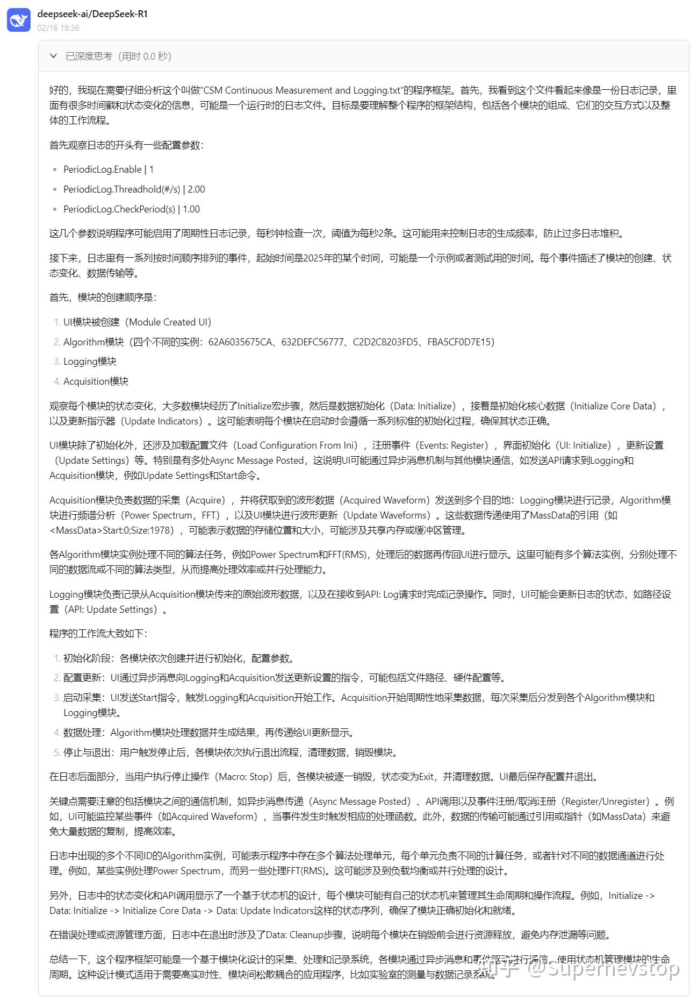

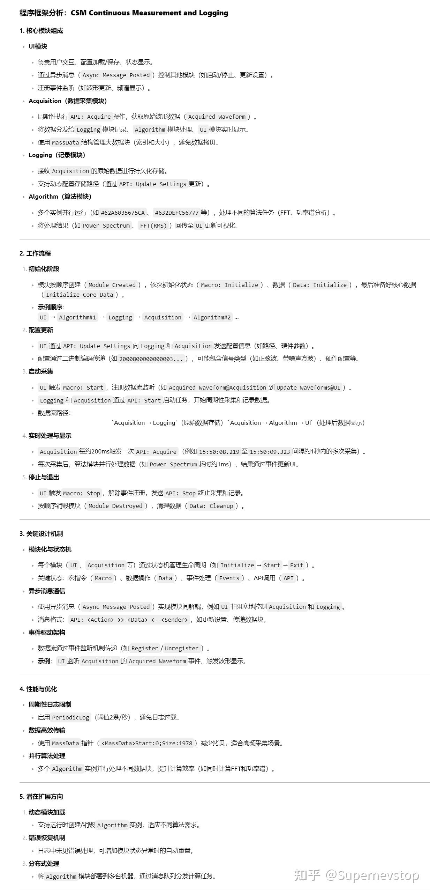

这一步最让我惊讶的地方在于：DeepSeek 的确识别出了这是一份程序运行日志，也能大致反推出模块协作方式、关键逻辑和潜在问题。它已经证明，单靠 csmlog 就足以让模型对 CSM 程序形成一版粗粒度理解。

但问题也很明显。因为它不知道 CSM 的语义规则，所以把日志格式误当成了消息格式，还错误理解了 Async Message Posted 在模块结构中的意义。也就是说，模型能看出轮廓，但还不能保证结构解释完全准确。

### 尝试 2：补充 CSM 语法和纠错信息

第二轮我把 CSM 的基本语法和说明补给模型，并针对第一次回答里明显不对的地方做了人工纠正，希望它在已有结论上继续收敛。

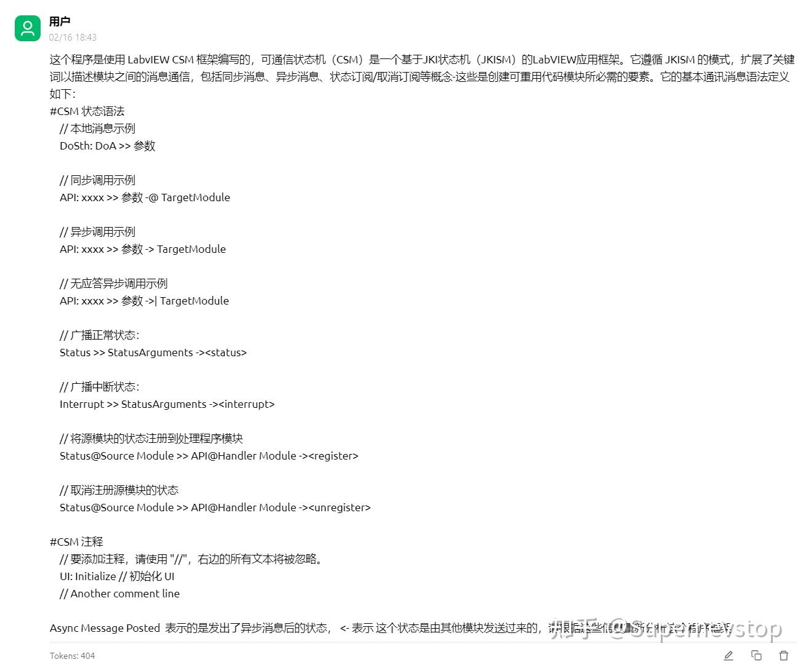

这一次的回答明显更像是在“读懂” CSM，而不是只是在“猜”日志含义。

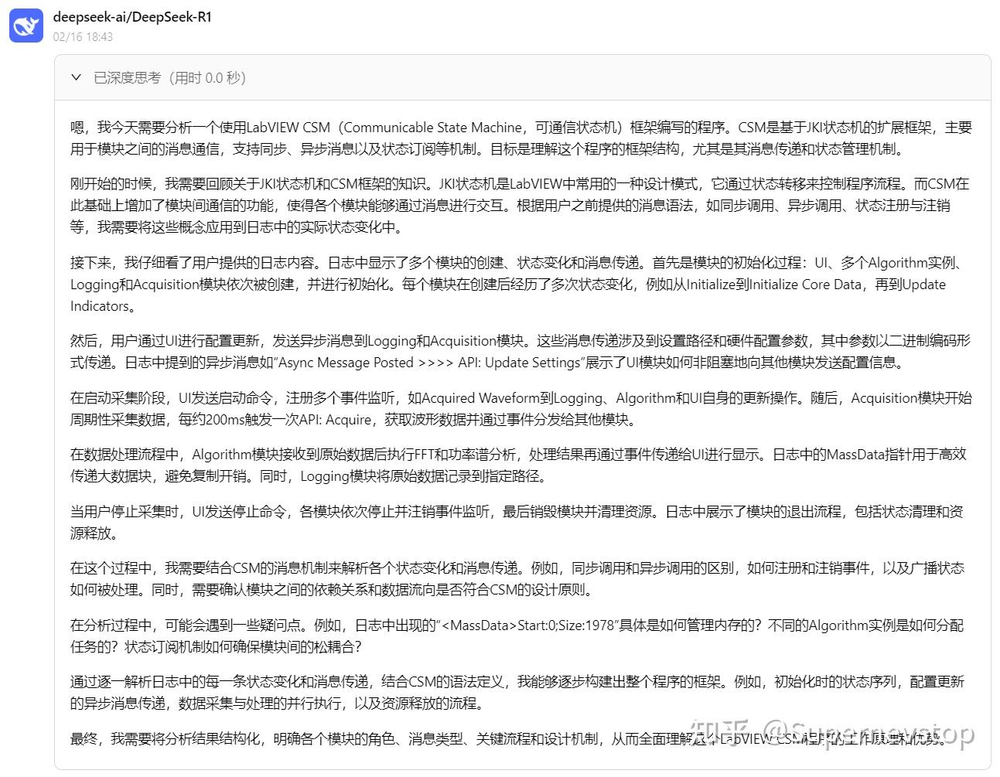

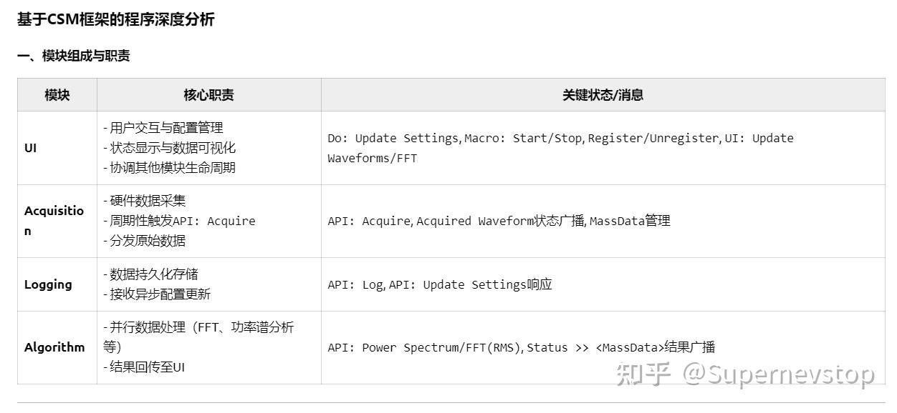

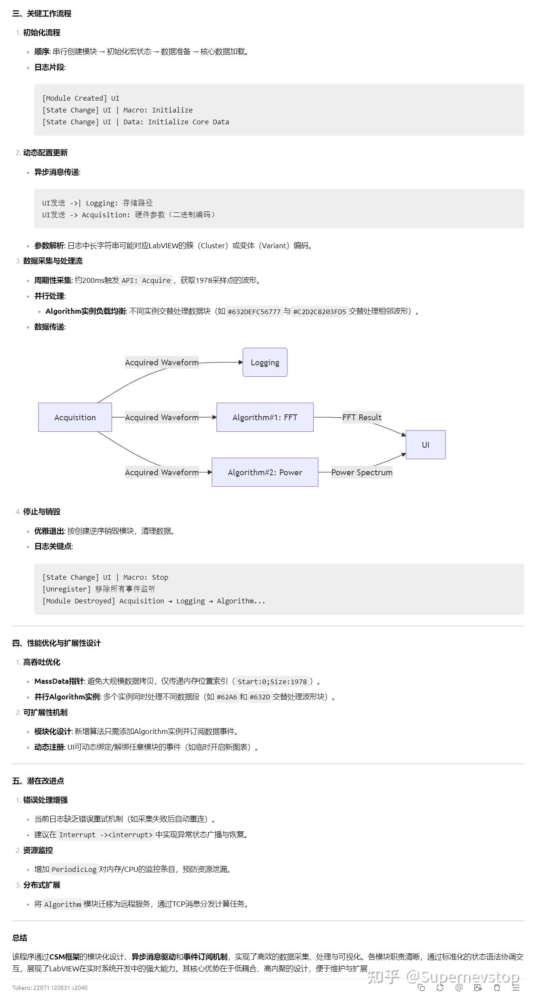

在这一轮里，DeepSeek 已经能够反向绘制状态订阅关系，并总结出各模块的功能与关键接口。虽然它绘制状态订阅图的方向和我正向整理文档时不一样，但结果已经和实际设计非常接近，这说明日志加上框架知识后，模型确实可以帮助快速理解一个复杂 CSM 程序。

不过仍然存在几类偏差：

- 它没有推断出 status 在使用前需要显式注册。
- 它把并不存在的资源泄露风险也当成了潜在问题提出。
- 它没有从日志里看出全局错误处理机制为何没有出现。
- 它对算法模块实例之间的关系理解还不够准确。

这些偏差说明，模型的理解已经进入“接近正确”的阶段，但仍然受限于输入信息的完备程度。

### 尝试 3：继续补充上下文，观察能力上限和边界

第三轮我继续补充背景，让 DeepSeek 在更充分的上下文里继续分析。

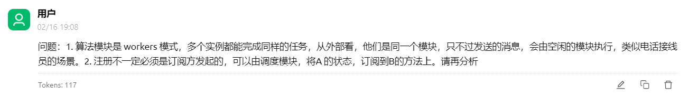

这一轮开始后，模型在很多地方已经能给出相当像样的结果。比如模块注册关系图：

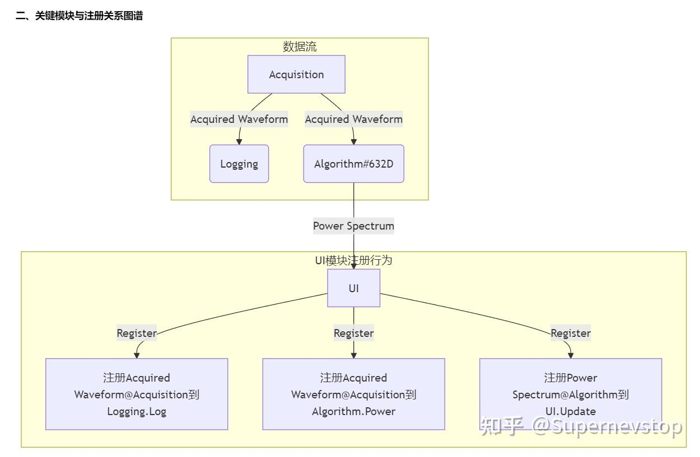

再比如它对性能和扩展性问题的分析：

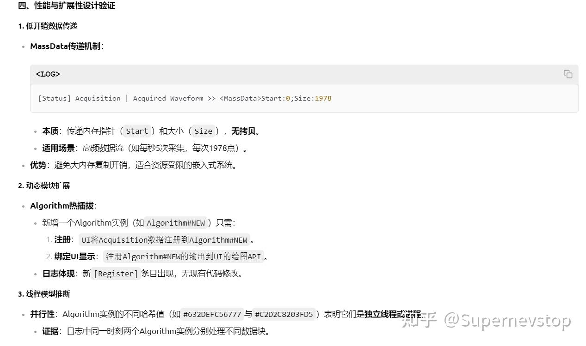

以及它对 CSM workers 模式的理解，甚至还能画出程序的运行泳道图：

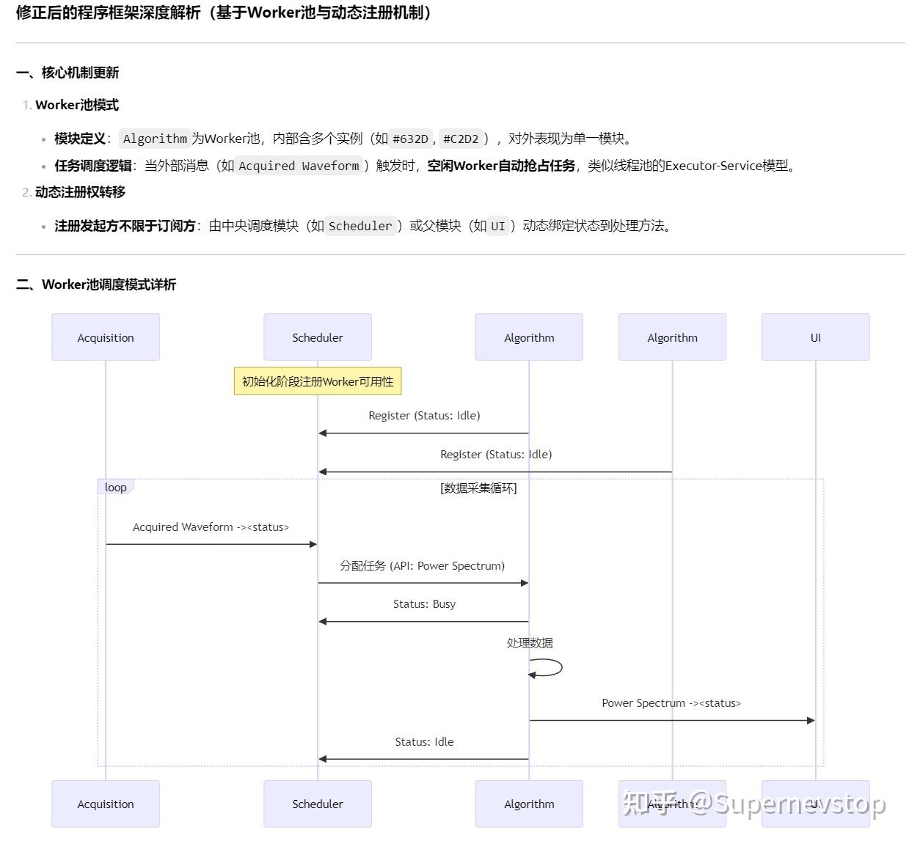

但也是在这一轮里，我更明确地看到了大模型的边界。它在回答里引用了一段“关键日志证据”，可那段日志根本不在我提供的文件中，属于典型的 AI 幻觉：为了补全推理链条，模型直接捏造了证据。

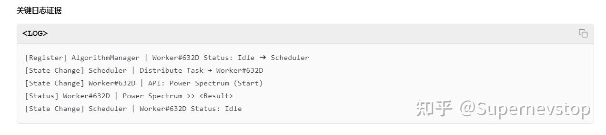

这一点非常关键。模型可以帮我们提高理解和整理效率，但所有关键判断仍然必须由熟悉系统的人来复核，尤其不能把它编造出来的中间依据直接当真。

## 四、结论与后续思路

把三轮实验放在一起看，我对“DeepSeek 能否帮助理解 LabVIEW CSM 程序”这个问题的结论是肯定的，但前提和边界同样明确。

首先，这种方法成立的前提是 CSM 框架本身具备完整日志能力。DQMH、AF 等其他 LabVIEW 框架在图形化编程和可观测性上的限制更大，至少在目前阶段，没有这么顺手的喂料条件。

其次，DeepSeek 确实能通过 csmlog 帮助我们更快理解复杂程序的结构与思路，包括整理功能、推断模块关系、辅助绘制状态转移图和状态订阅图，甚至为文档化工作打底。

再次，模型的回答必须经过人工验证。只要它还会捏造日志、补全不存在的证据，就不能把它当成可信的最终裁判，而只能当成高效率的分析助手。

最后，如果后续把 CSM 文档、语法说明和更多真实案例一起组织起来，也许可以进一步做成一个专门面向 csmlog 的工具链，让模型实时或离线分析日志并产出 Mermaid 图和解释建议。

这次实验的成本也很低：文中记录的几轮问答总计使用 82654 tokens，花费约 0.4671 RMB。

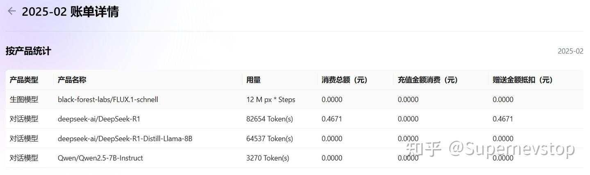

如果你也在用 LabVIEW 做复杂系统开发，这条路值得继续试。大模型确实能显著提高生产力，但前提是你愿意把工作流、日志和知识材料整理成它能读懂的形式，同时保留工程师对结果的最终判断权。