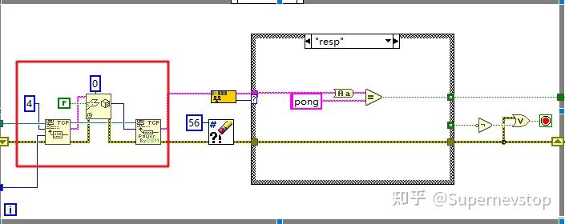
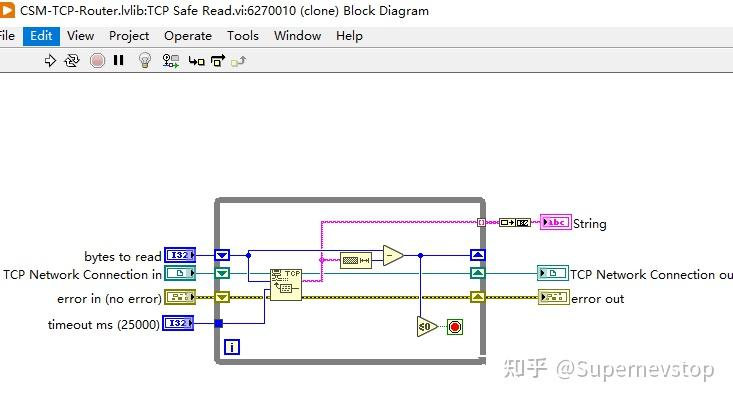

> 本文整理自知乎回答，并按站点文档风格进行结构化排版。
> [原文链接](https://www.zhihu.com/question/35991100/answer/1910979775754925067)

这条回答针对的是一个很常见、也很容易被误判的问题：LabVIEW TCP 通讯一开始运行正常，但长时间运行后偶发报错 `56`，提示“网络操作超出用户指定范围或系统时间限制”。如果处理思路只盯着超时时间，通常治标不治本；真正更有效的做法，是先把通讯数据包的边界定义清楚。

## 问题为什么会反复出现

TCP 本身是字节流，不保证你一次 `read` 就能拿到完整的业务数据包。只要发送端和接收端在节奏上稍微错位，或者网络波动导致数据拆分，接收端就可能在“还没读完一包”的时候超时，最终表现为 56 错误。

原回答给出的核心判断很直接：**不要用“时间刚好对上”来赌整包读写，而要显式定义包长。**

## 推荐的数据包格式

更稳妥的方式是定义统一的长度帧格式：

1. 先发送 `DataLength`，固定 4 bytes。
2. 再发送实际数据包，长度为 `xBytes`。
3. 接收端先读长度，再按长度把后续数据完整读出来。

这样做的直接收益有三点：

- 避免把“收没收全一包”交给超时机制去猜。
- 发送端采集频率变化时，接收逻辑仍然稳定。
- 可以显式发送 `DataLength = 0` 的空包，当作心跳包使用。

## 读取策略

接收侧流程可以收敛成一个简单且稳定的模式：

1. 先读取 4 bytes，获得当前包长度。
2. 如果长度为 0，按心跳包处理。
3. 如果读取长度阶段出现 56 错误，可结合业务需求按“忽略并继续等待下一包”处理。
4. 再按长度读取完整 payload，而不是只读一次就认为数据已经到齐。

这套做法的本质，是把“包边界”从时间层面搬到协议层面，减少长时间运行时的偶发错位。

## 大数组场景还要注意什么

原回答还提到一个额外风险点：如果传输的是 `DBLArray` 这类平铺后的大块数据，有时一次读写并不能完整覆盖全部数据，需要按元素个数或分片方式做拼接，确保最终拿到的数据是完整的。

否则系统在短时间测试里可能看起来正常，但一旦进入长时间运行，就会偶发出现读取不完整、数据错位或后续解析失败等问题。

## 这条经验适合用在哪些场景

这类处理方式特别适合下面几种场景：

- 持续采集并通过 TCP 输出测量数据。
- 客户端和服务端执行周期不完全一致。
- 长时间运行后偶发超时，而不是启动就报错。
- 需要心跳包维持连接状态。

## 小结

如果你的 TCP 通讯偶发 56 错误，优先排查的不是“把超时设更大”，而是协议层是否已经明确定义了数据边界。固定 4 bytes 长度头、按长度读取 payload、必要时加入空包心跳，再配合大数组分片拼接，通常会比单纯调参数更有效。
