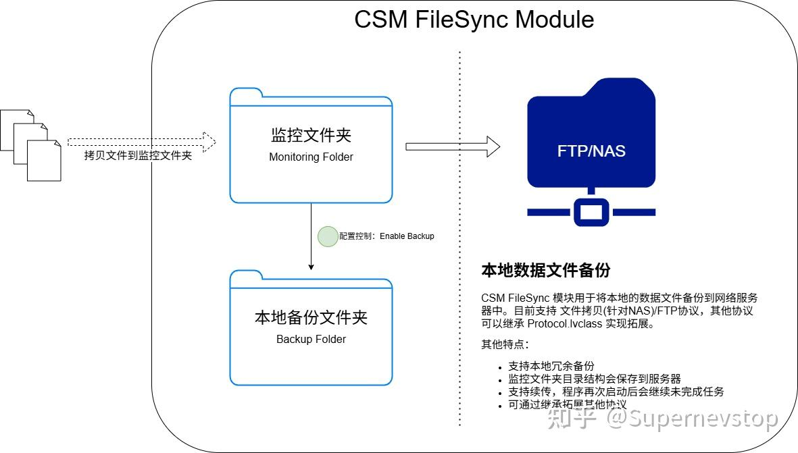
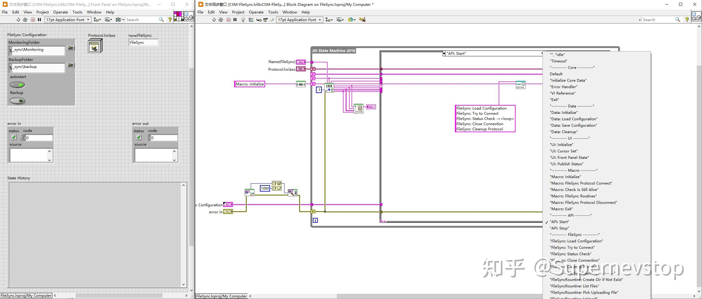
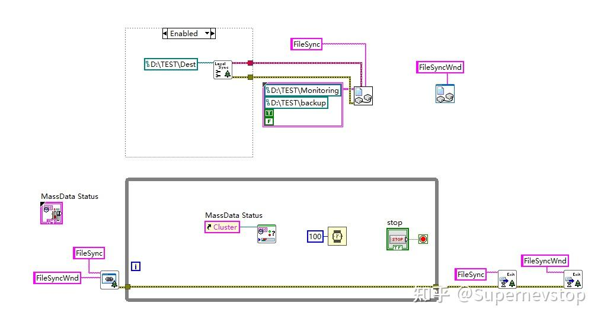

> 本文整理自知乎专栏原文，并按站点文档风格进行结构化排版。
> [原文链接](https://zhuanlan.zhihu.com/p/1915755577830768707)

这篇文章属于“CSM-Module”系列，目标很明确：把一个可独立复用的功能模块做成标准化 CSM 组件，既能直接嵌入项目，也能作为展示 CSM 模块设计方式的样例。

相关链接：

- [项目仓库](https://github.com/NEVSTOP-LAB/CSM-ModSets-FileSync)

## 模块定位

CSM FileSync 的职责是把本地数据文件同步或备份到目标服务器。当前原文提到的能力主要包括：

- 支持文件拷贝，适合 NAS 类目标。
- 支持 FTP 协议。
- 支持本地冗余备份。
- 保留监控目录结构到服务器端。
- 支持续传，程序重启后继续未完成任务。
- 可通过继承 `Protocol.lvclass` 扩展更多协议，例如 WebDAV。

## 模块展示

原文同时给出了模块界面与交互形态，展示了它不是一组零散 VI，而是一个完整的、可以被外部调用和观察状态的 CSM 模块。

## 下载与集成

原文中提到的使用条件包括：

1. 源码开发版本为 LabVIEW 2020。
2. 可以从 GitHub 仓库直接获取源码。
3. 也可以在 GitHub Release 中下载已编译好的 `lvlibp`。

如果你是把它作为现成模块接入项目，优先关注 Release 和依赖关系；如果你计划继续扩展协议，则更适合直接从源码接入。

## 使用方式

文中推荐从示例工程 `src_example/App - FileSync Example.vi` 开始理解。

集成方式可以概括为：

1. 通过 `CSM-FileSync.lvlib` 中定义的 External API 调用模块。
2. 在使用源码时，也可以直接通过 CSM API 调用。
3. 如果需要界面呈现，可把同步状态映射到 `FileSyncWindow`。
4. 若当前协议不满足需求，可仿照 `FTPProtocol.lvclass` 扩展新的协议实现。

## 为什么这个模块值得单独拿出来讲

这类“文件同步备份”需求本身并不新，但把它做成标准化 CSM 模块之后，会有两个直接收益：

- 业务工程只关心何时同步、同步哪些目录，不需要把协议逻辑散落到主应用中。
- 后续如果从 FTP 切到其他协议，变更点可以收敛在协议实现层，而不是在所有调用方里同时改动。

这也是 CSM-Module 系列的一个核心价值：不仅提供功能，更提供“如何把功能做成可复用模块”的范式。

## 扩展方向

原文明确欢迎开发者基于现有协议实现继续扩展，比如新增 WebDAV 等协议支持，并通过 PR 方式回流到仓库。这种开放方式很适合把模块逐步沉淀成社区可复用资产。

## 开源说明

和系列中其他模块一样，原文最后保留了使用提醒：示例和模块代码可以参考或直接接入，但最终是否满足项目要求，仍然需要结合自己的稳定性、部署环境与数据安全约束来判断。
