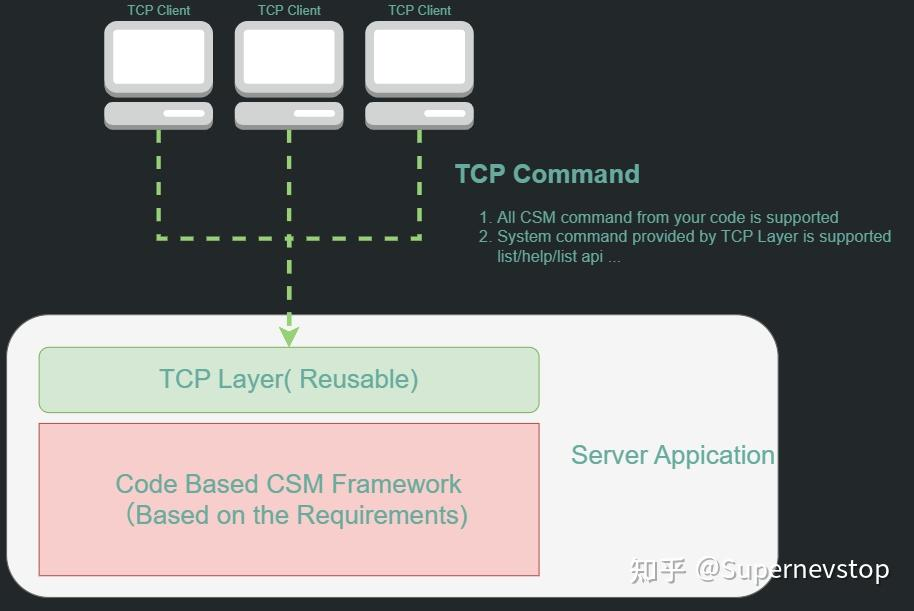
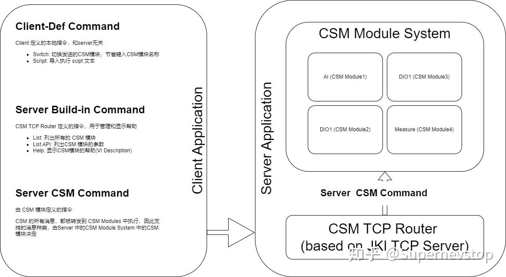
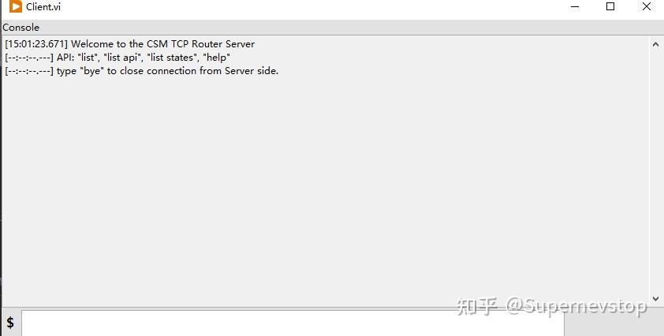
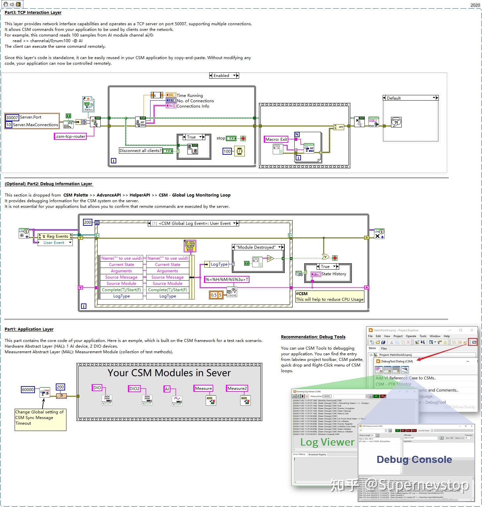
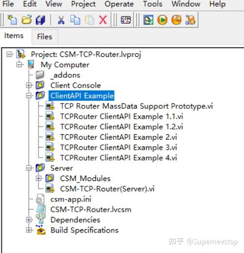

> 本文整理自知乎专栏原文，并按站点文档风格进行结构化排版。
> [原文链接](https://zhuanlan.zhihu.com/p/1921874518592431891)

这篇示例文章讨论的不是“如何从零开始写一个 TCP 服务器”，而是如何在不侵入现有 CSM 应用逻辑的前提下，加上一层可复用的 TCP 通讯能力，让本地程序可以被远程控制。

相关链接：

- [项目仓库](https://github.com/NEVSTOP-LAB/CSM-TCP-Router-App)

## 方案概览

CSM-TCP-Router 的思路是把 TCP 通讯封装成一个可复用的 CSM 通讯层。这样一来，原本依赖 CSM 内部消息总线运作的应用，不需要大改结构，就能通过 TCP 对外暴露控制入口。

原文强调了这个示例想展示的重点：**利用 CSM 的隐形总线，把远程控制能力叠加到现有程序上，而不是把业务逻辑重新改写成网络逻辑。**

## 支持能力

这个示例当前支持的能力包括：

- 本地可发送的 CSM 消息可以通过 TCP 连接转发。
- 支持同步消息、异步消息与状态订阅。
- 基于 JKI-TCP-Server，可同时服务多个 TCP 客户端。
- 支持 CSM MassData Argument。
- 自带标准客户端，用于验证远程连接和消息发送。
- 提供 LabVIEW 侧 Client API，便于嵌入到其他程序中。
- 由于消息包本质上是文本格式，也便于其他语言实现客户端。

## 通讯协议设计

原文给出了一个简洁的数据包结构：包头固定、正文使用文本格式。整体思路可以概括为以下几部分。

### 包头字段

- `数据长度 (4B)`：表示数据字段长度。
- `版本 (1B)`：用于版本兼容，当前为 `0x01`。
- `FLAG1 / FLAG2 (各 1B)`：保留字段。
- `TYPE (1B)`：描述数据包类型。

### 数据包类型

目前支持的类型包括：

- `info`：提示信息。
- `error`：错误信息。
- `cmd`：指令数据包。
- `resp`：同步响应。
- `async-resp`：异步响应。
- `status`：状态订阅返回数据包。

这套设计的关键点是：**把“传输协议”与“CSM 指令文本”分离开**。TCP 层负责分帧和传输，CSM 层负责解释命令本身。

## 指令集划分

原文把可用指令分成三类，这个划分很实用。

### 1. 原有 CSM 消息指令

这部分由你的应用本身定义。例如某个模块已经支持 `Read`、`Read All`、`Start Sampling` 之类接口，那么 TCP 侧直接发送同样的文本消息，就能远程调用这些接口。

### 2. CSM-TCP-Router 自身指令

这部分用于管理通讯层本身，例如：

- `List`：列出全部 CSM 模块。
- `List API`：列出指定模块 API。
- `List State`：列出指定模块状态。
- `Help`：显示模块帮助文档。
- `Refresh lvcsm`：刷新缓存文件。

### 3. Client Only 指令

标准客户端本身还定义了一些只在客户端可用的辅助命令，例如：

- `Bye`：断开连接。
- `Switch`：切换默认模块上下文。
- `Tab`：快速切到输入框。

## 测试运行方式

原文给出了两条典型路径。

### 使用 Console Client 连接

1. 在 VIPM 中安装工具及依赖。
2. 打开示例工程 `CSM-TCP-Router.lvproj`。
3. 启动 `CSM-TCP-Router(Server).vi`。
4. 启动 `Client.vi`，输入服务器地址和端口。
5. 发送指令并查看返回结果。
6. 在服务端界面查看执行历史。
7. 输入 `Bye` 断开连接。

### 使用 Client API 连接

1. 安装工具及依赖。
2. 打开同一套示例工程。
3. 启动服务端。
4. 运行 `ClientAPI Example` 验证集成方式。

## 这个示例真正说明了什么

从架构角度看，这个示例最值得关注的不是 TCP 协议细节，而是它展示了 CSM 的一个重要优势：**通讯能力可以作为横切模块叠加到现有系统，而不需要把原应用的模块边界打散。**

如果你的系统已经按 CSM 模块化组织，那么类似的远程接入层、调试层、自动化层，理论上都可以复用这种思路来加。

## 开源说明

原文最后保留了开源使用提醒：在使用示例代码前，仍然需要根据自己的项目约束判断它是否满足稳定性、安全性和长期维护要求。示例很有参考价值，但并不替代面向实际项目的工程验证。
