> 本文整理自知乎专栏原文，并将图片等资源本地化以便站内稳定访问。
> 原文链接：https://zhuanlan.zhihu.com/p/1942689627426264231

在 2025 年 7 月 23 日的 Webinar 中，我们通过一个具体的 DAQ 实例，深入讲解了其背后的设计思路与实现方法，对比分析了 CSM 与 DQMH 的差异，并着重说明了 CSM 在团队协作与模块复用方面的显著优势。本文是对该次 Webinar 的简要介绍。如需查看完整 PPT，可在以下地址下载：

- https://github.com/NEVSTOP-LAB/csm-keynotes-collection
- https://gitee.com/NEVSTOP-LAB/csm-keynotes-collection

## 场景：数据采集、分析和记录的场景

假设我们在日常工作中，接到了这样的一个场景：

1. 需要创建一个连续的数据采集、存储和分析系统。
2. 分析算法暂时不明确。
3. 后期可能需要支持中控系统，需要被远程控制和数据备份。
4. 硬件仍在采购中，但是项目周期比较紧张，先要编写程序。
5. 新人同事小李与你一起完成这个项目。
6. 交付后，这个项目会部署偏远地区，可能需要长期支持。

## 从架构师角度：CSM 能够让架构师更加自由地完成设计

对于这类需求，我们可以很容易地将模块划分成下图所示的架构。你可以选择成熟的框架（例如 DQMH 或 CSM）作为程序的骨架，也可以使用 QMH 这类较为简单的 LabVIEW 模板。但架构师在实际设计中，还需要预先考虑实施过程中可能出现的潜在问题，才能确保项目按设想的方式分工协作，代码实现简洁清晰，功能模块易于组装整合，交付后便于维护，并且能够应对未来的功能扩展。

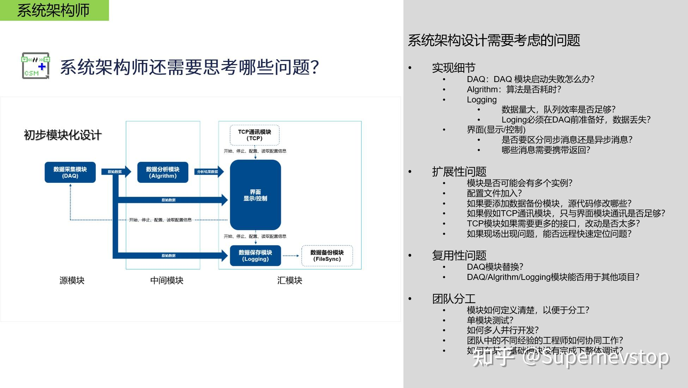

在本次 Webinar 中，我们主要分析了 CSM 框架的以下几项特性，它们分别针对了一些实际可能遇到的问题进行了设计与优化。

### 1. CSM 完善且独特的消息机制

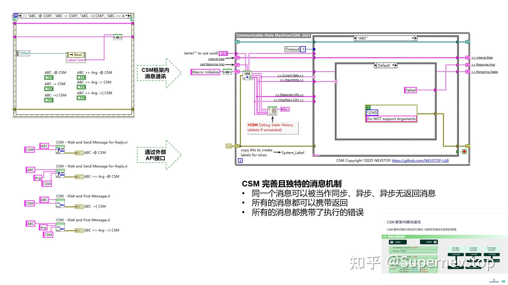

CSM 具备一套完善且独特的消息机制，具有以下特点：

- 同一消息可灵活用作同步、异步或异步无返回等多种处理方式。
- 所有类型的消息都支持携带返回信息。
- 每条消息都会自动携带执行过程中的错误状态。

这样可以应对以下常见问题：

- DAQ 模块启动失败怎么办？如果执行过程中出现错误，错误信息会返回给调用方，便于编写错误处理逻辑。
- Logging 必须在 DAQ 前准备好，否则可能导致数据丢失？通过同步消息机制，可以确保 Logging 模块先启动，再向 DAQ 模块发送启动消息，从而避免数据丢失。
- 设计时是否需要区分同步消息与异步消息？哪些消息需要返回值？CSM 框架中，所有消息既可作为同步也可作为异步消息使用，并且每一条消息都可以携带返回值。

### 2. CSM 订阅机制与更内聚的模块设计

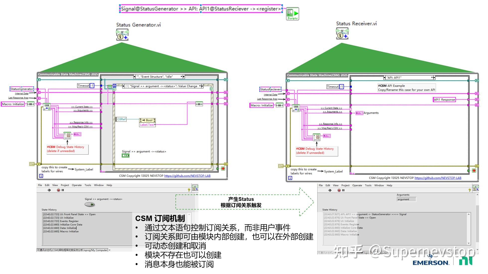

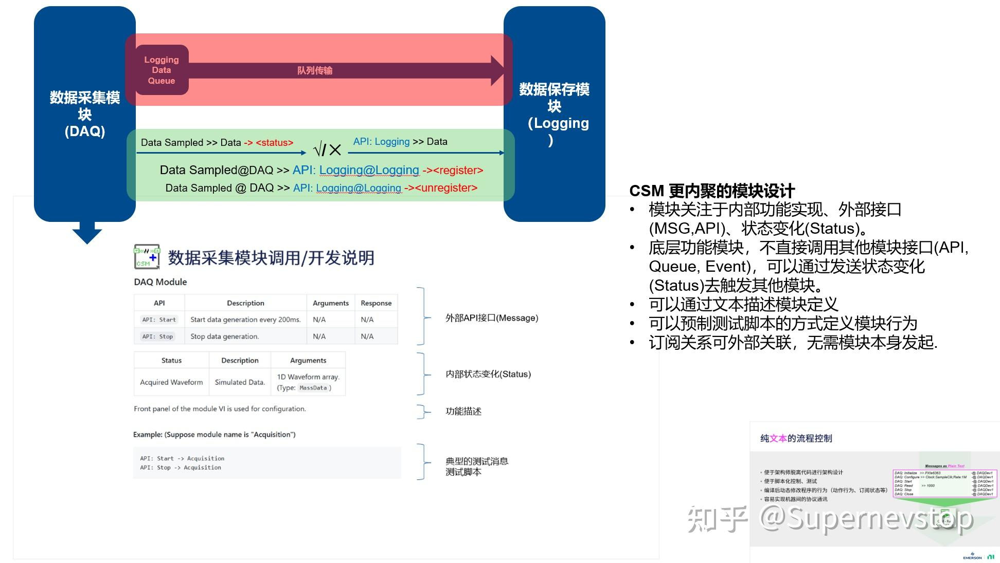

CSM 更加注重高内聚的模块设计，具体体现在：

- 每个模块应专注于三个方面：内部功能实现、对外消息接口（MSG/API）以及自身状态变更（Status）。
- 底层功能模块不直接调用其他模块接口，而是通过发送状态变更（Status）触发其他模块行为。
- 支持通过文本方式描述和定义模块结构。
- 可通过预制测试脚本定义模块行为，提高可测试性和可维护性。
- 模块间订阅关系可在外部配置和关联，无需由模块自身主动发起，进一步降低耦合。

这种设计使得 DAQ/Algorithm/Logging 等模块更容易替换和复用。模块协作由外部调度逻辑实现，各模块通过虚拟总线通信，不依赖 LabVIEW 图形化连线，从而显著提升独立性与可复用性。

### 3. CSM 已有不少插件功能

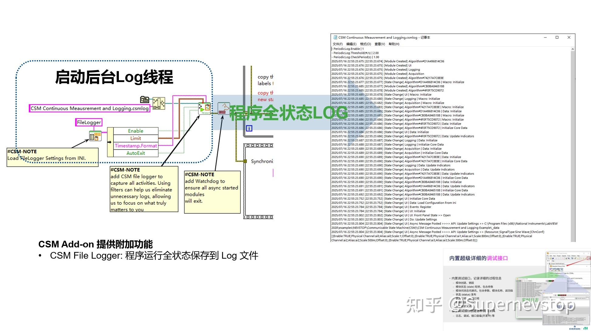

CSM 提供了丰富的附加功能和扩展接口，便于实现更多定制化需求：

- CSM File Logger：可将程序运行的完整状态保存至日志文件。
- CSM INI Variable：为 CSM 提供更便捷的 INI 配置文件支持。
- CSM TCP Router：将该模块独立部署后，所有 CSM 模块接口功能均可通过 TCP 远程调用。
- CSM File Sync Module：独立的文件同步模块，支持将本地文件备份至 NAS 或 FTP 服务器。

这些功能可有效应对以下问题：

- 如需添加数据备份模块，应修改哪些源代码？只需加入 CSM File Sync Module，或自行创建独立上传模块并集成到主程序中。
- 若需添加 TCP 通信模块，仅与界面模块通信是否足够？利用 CSM TCP Router 可一次性将全部 CSM 模块接口网络化，无需大量修改。
- 现场出现问题时，能否远程快速定位？通过 CSM File Logger 可将所有模块运行日志完整记录下来，便于后续分析与问题诊断。

### 4. 其他

总而言之，CSM 能够帮助架构师更灵活地设计系统架构，在实际开发中，所绘制的模块图能够更少遇到细节问题。CSM 模块的接口定义也可以完全通过文本描述，方便设计与归档。如果用一个词来形容 CSM 带来的感受，那就是：自由。

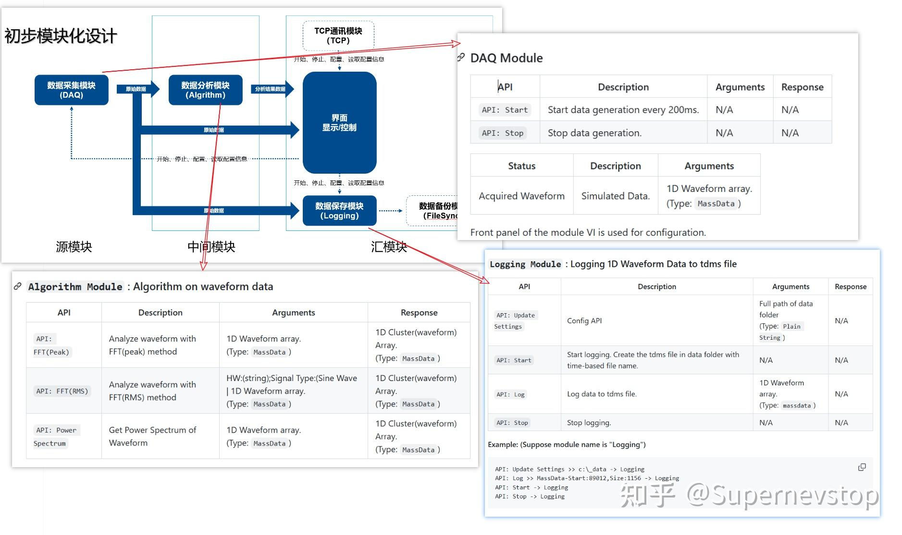

## 从开发人员角度：CSM 框架设计精简，降低学习门槛

### 1. VI 就是模块，模块就是 VI

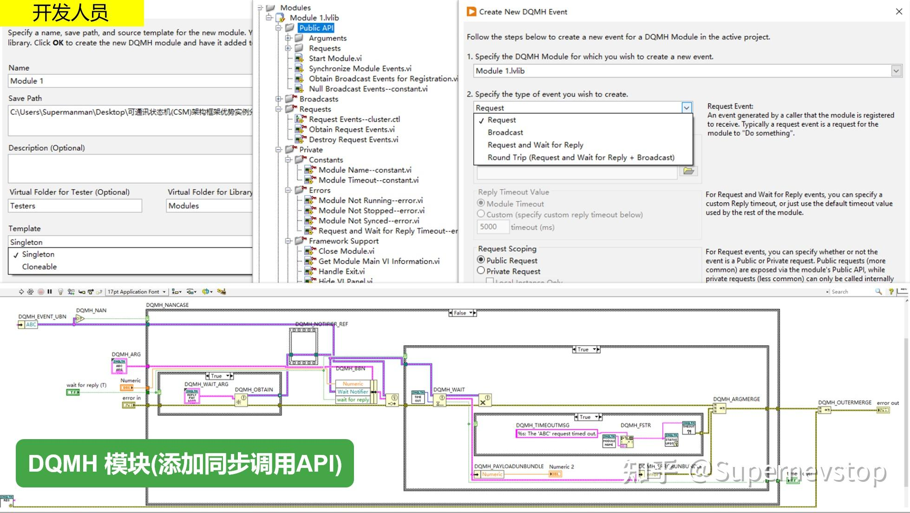

与 DQMH 相比，实现相同功能时，CSM 所需 VI 数量显著减少。使用 CSM 框架时，一个 VI 即可包含模块全部接口和顶层逻辑，即使刚接触的开发者也能直观理解其逻辑、运行和调试过程。

### 2. 开发人员根据模块描述完成功能实现

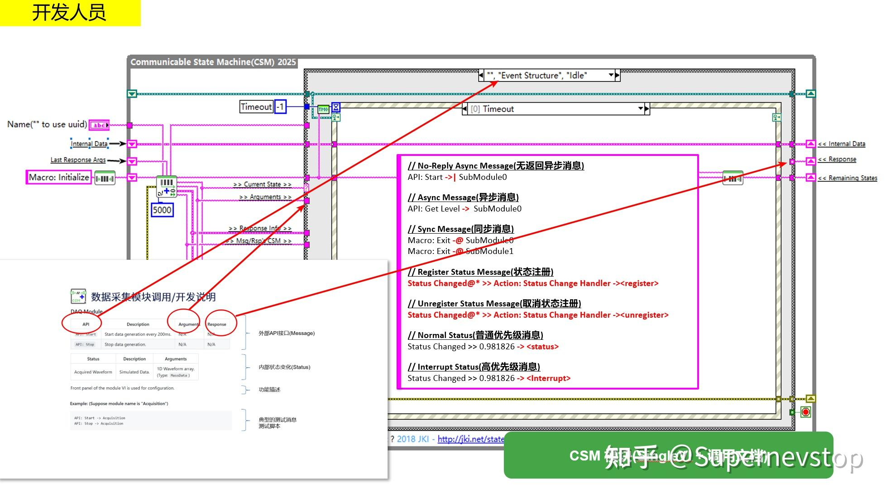

开发人员在使用 CSM 进行模块实现之前，需要了解以下基本信息：

- 接口（API）：对应 CSM 模块中 Case 结构的分支名称，名称大小写不敏感。
- 参数（Argument）：通过 >>Argument>> 连线输入至模块内部。
- 返回（Response）：只需连接至 <<Response 即可输出。
- 状态变化（Status）：通过 CSM - Broadcast Status Change.vi 发布出去。
- 参数/返回的打包与解包：根据实际应用选择不同数据处理方式（如 API String、MassData、HexStr 等）。

熟悉这些规则后，开发人员即可基于需求设计状态机并实现模块功能。本质上，每个模块的实现即编写一个符合特定要求的 VI。与 DQMH 或 Actor Framework（AF）相比，CSM 对模块开发人员更简单易用。

### 3. 丰富的调试工具

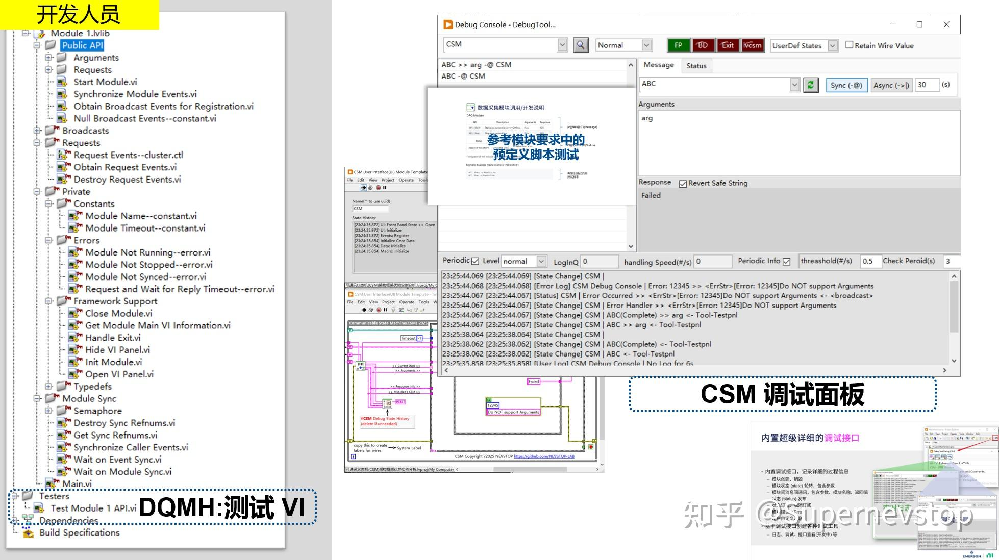

CSM 内置了实用调试工具，支持从多个维度调试模块，且无需编写额外代码。需求文档中通常会定义一些典型消息，通过调试工具发送这些消息即可测试模块功能，让模块在集成到整个系统之前先完成充分自验证。

## 总结

CSM 能够有效帮助架构师减少实现细节对整体架构的冲击，从而在设计中获得更高自由度。

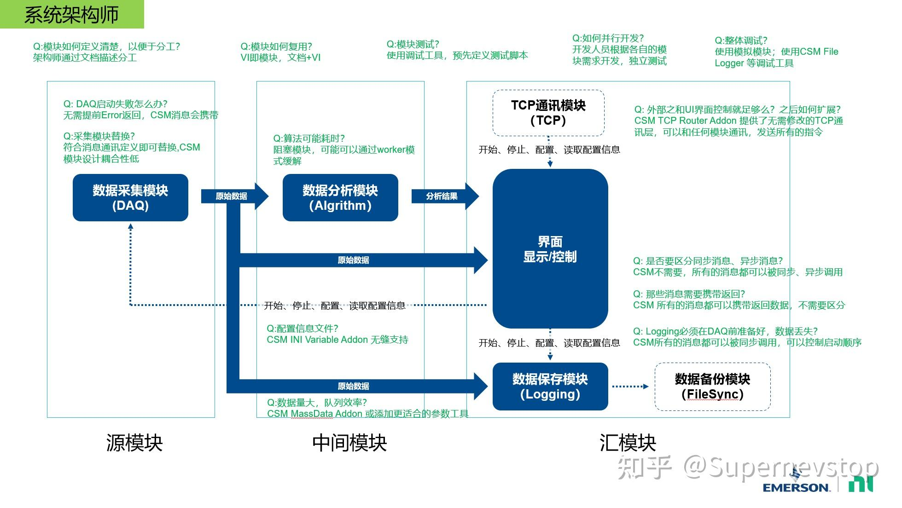

CSM 高度内聚的通信机制使得模块更容易被分解和复用。同时，CSM 采用隐藏式框架设计，将框架复杂性封装于后台，开发者可见代码几乎全部为业务逻辑，显著降低了学习和使用门槛。这两大特点使不同经验水平的工程师能够更高效协同工作，也有利于团队沉淀可复用模块、减少重复开发。

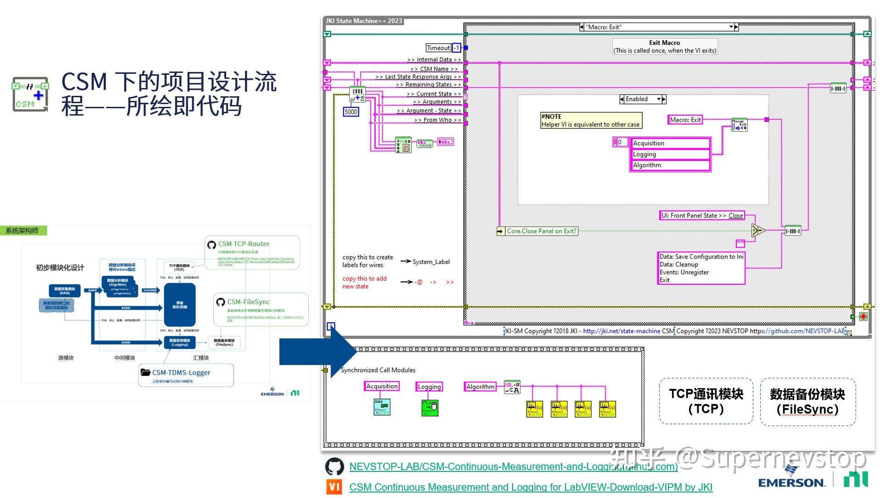

欢迎通过 VIPM 下载 CSM-Continuous-Measurement-and-Logging 示例程序，以便更直观地理解文中内容。欢迎大家留言交流讨论。
