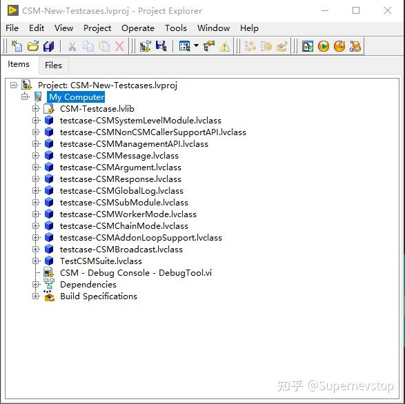
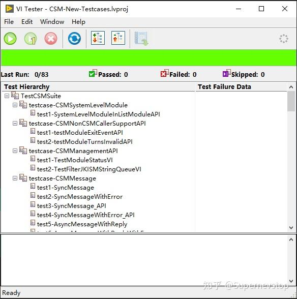

> 本文整理自知乎专栏原文，并按站点文档风格进行结构化排版。
> [原文链接](https://zhuanlan.zhihu.com/p/2002341676576969869)

2025Q4，CSM 项目补上了一轮更系统的单元测试建设。借助 JKI VI Tester，这一轮新增了 83 个测项，使 CSM 的单元测试总数增长到 144 个；同时，测试流程已经接入 GitHub Workflow，用来在每次代码变更后自动回归，尽量把框架级回归问题挡在合并之前。

这篇整理版不再照搬知乎原文里的完整测试明细表，而是保留更适合站内阅读和后续维护的内容：为什么要做、覆盖了哪些能力、日常维护时需要注意什么。

## 项目背景

对 CSM 这种通信和状态驱动都比较重的框架来说，代码改动最怕的不是单点 bug，而是悄悄打破既有消息链路、广播关系或模块生命周期行为。单元测试的意义就在这里：

- 用稳定的测试夹具覆盖核心行为，而不是依赖人工回归。
- 把消息、广播、日志、系统级模块等关键机制拆成可验证的测试类。
- 把测试运行嵌入 CI，让每次提交都能重复执行同一套验证流程。

原文里引用的详细说明文档见：[CSM_Unittest_README(zh-cn)](https://github.com/NEVSTOP-LAB/Communicable-State-Machine/blob/main/.doc/CSM_Unittest_README%28zh-cn%29.md)。

## 运行环境

当前这套单元测试依赖的基本环境比较直接：

- Windows 10
- NI LabVIEW 2017 (32-bit)
- JKI VI Tester

如果你的本地环境需要先对齐工具链，建议先确认 VI Tester 版本与 LabVIEW 版本兼容，再开始补充或调试测试项。

## 测试覆盖面

下面两张图分别展示了项目结构和 JKI VI Tester 中的测试执行界面：

这轮单元测试不是只补一两个接口，而是按 CSM 的主要能力分成多个测试类系统推进。

### 消息、参数与返回值

这是最核心的一层，主要验证模块间通信是否可靠：

- Message：覆盖同步消息、异步有返回消息、异步无返回消息，以及不同 CSM 模式之间的消息传递。
- Argument：验证参数在不同模式下的传递与解析，包括 HexString、ErrorString、SafeString 等特殊形态。
- Response：验证普通消息、带错误消息、宏消息以及多种返回路径下的响应行为是否符合预期。

这一部分本质上是在确保“消息有没有发到”“参数有没有带对”“返回值和错误有没有丢”这三件最基础、也最容易在重构时被破坏的事情。

### 广播与日志

CSM 的另一个重点是广播和可观测性，因此单元测试也把这块拆得比较细：

- Broadcast：覆盖 status、interrupt、state change 等广播机制，以及注册、反注册、选择性注册和非 CSM 调用方订阅等场景。
- Global Log：同时验证全局日志队列和全局日志用户事件两套实现，确保模块创建、销毁、状态轮转、消息、广播与用户日志都能被稳定记录。

其中广播类测试尤其重要，因为它往往跨模块、跨优先级，而且容易受到执行顺序和机台资源状态影响。

### 模块结构与运行模式

为了避免只测到“普通模式下能跑”，这轮测试还覆盖了多种模块结构和框架模式：

- System Level Module：验证系统级模块在列表 API 中的识别逻辑。
- SubModule：验证一级与多级子模块的枚举与检索能力。
- Worker Mode：验证协作者节点之间共享属性数据的行为。
- Chain Mode：验证责任链节点的 Allowed Messages、广播联动和退出顺序。
- CSM Loop Support：验证循环模式下模块既能处理外部消息，也能继续向外发送消息而不发生阻塞。

这些测试的价值在于，它们把 CSM “不同运行形态下的语义”也一并纳入了回归范围，而不只是验证某几个 API 调用能否通过。

### 管理接口与外部调用支持

除了框架内部消息机制，原文也专门补上了两类很实用但容易被忽视的能力：

- Management API：验证模块状态读取、节点数量识别以及多态过滤接口的行为。
- Non-CSM Caller Support API：验证外部调用方依赖的模块退出事件和模块失效通知接口。

这能帮助框架在与外部工具、上层应用或调试辅助模块协同时保持稳定边界。

## 为什么这套单元测试值得保留

把测试数量从 61 个扩到 144 个，真正提升的不只是“覆盖率”这个数字，而是后续迭代的信心边界：

- 改消息流程时，可以更快知道是否破坏了同步、异步或宏消息语义。
- 调整广播和日志机制时，可以通过自动回归及时看到副作用。
- 引入新的模式支持或管理接口时，不需要再完全依赖人工联调。

对一个会长期演进的框架来说，单元测试的意义不是一次性把功能证明正确，而是把“未来改坏了怎么办”这件事制度化。

## 维护注意事项

原文里有三条维护约束，迁移到站内后依然值得保留：

1. 广播测试建议放在最后执行。这类测试更容易占用机台资源，顺序不当会干扰后续用例。
2. 新增测试项前，先检查对应测试类最后一个用例的尾部代码。如果之前为了测试结束关闭了 CSM 模块，需要先恢复模块重启逻辑，再继续追加新的测项。
3. 调试时建议配合 CSM 自带的 Debug Console - DebugTool.vi，一边手动发送消息和观察返回，一边看日志处理速度、队列数量等运行状态。

如果后续继续扩展测试集，优先保证这三条纪律不被打破，比简单追求“测项越多越好”更重要。

## 相关资源

- [NI LabVIEW 官方文档](https://www.ni.com/labview)
- [CSM 框架仓库](https://github.com/NEVSTOP-LAB/Communicable-State-Machine)
- [JKI VI Tester Toolkit](https://www.ni.com/zh-cn/support/downloads/tools-network/download.vi-tester-unit-test-framework.html)

如果你正在维护 CSM 或准备给自己的 LabVIEW 框架补齐自动化验证，这套单元测试的组织方式本身就很值得参考：先把最容易回归的通信语义固定下来，再把广播、日志、生命周期和运行模式逐步纳入持续回归。