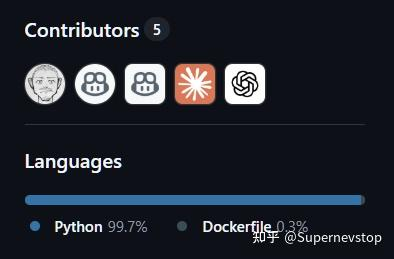
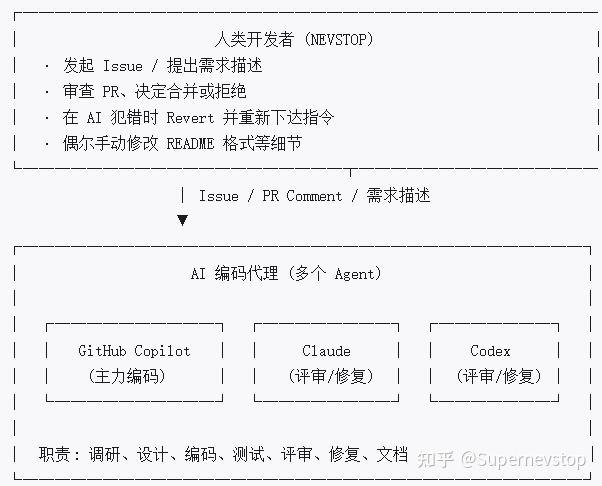
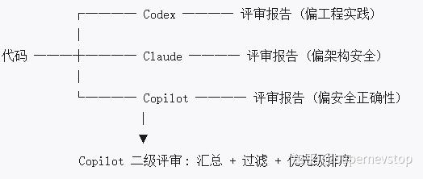

> 本文整理自知乎专栏原文，并按站点文档风格重新排版。
> [原文链接](https://zhuanlan.zhihu.com/p/2022067813548868073)

这篇文章记录的不是一个抽象的方法论，而是一次完整的实战复盘：围绕 GitHub 与 Gitee 的仓库同步需求，我尝试尽可能把开发、评审、修复与调优都交给 AI 完成，同时把人类的职责收缩到需求提出、方向把控与最终决策。

对我而言，这件事的意义不只是做出一个能跑的工具，而是验证一件更根本的事：在 AI 快速改变软件开发方式的背景下，LabVIEW 和 CSM 这类已经沉淀多年的工程资产，如何继续融入新的多语言生态，而不是被简单替代。

相关链接：

- 项目仓库：https://github.com/NEVSTOP-LAB/GitHub-Gitee-Sync
- [知乎原文](https://zhuanlan.zhihu.com/p/2022067813548868073)

> 👨: BY HUMAN
> AI 驱动开发已经是不可阻挡的趋势。对测试测量行业来说，程序开发追求的不只是速度，稳定可靠仍然是更底层的要求。语言只是手段，方法论和工程约束并没有因为 AI 出现而消失。CSM 这样的框架如果继续向多语言方向演化，反而会因为 AI 生态而获得新的生命力。

> 👨: BY HUMAN
> 声明：本文档基于 GitHub-Gitee-Sync 项目的完整开发历史整理而成。该项目从第一行代码到最终可用的 GitHub Action，代码实现部分由 AI 完成，我主要负责需求提出、方向把控与最终决策。



## 1. 项目概况

| 属性 | 详情 |
| --- | --- |
| 项目名称 | GitHub-Gitee-Sync |
| 项目功能 | 在 GitHub 与 Gitee 之间同步仓库代码与附属元数据，包括 Wiki、Release、Label、Milestone 等 |
| 最终交付物 | Python 工具 + Docker 镜像 + GitHub Action |
| 代码量 | 约 6,600 行，其中约 3,200 行为测试代码 |
| 测试规模 | 181 个测试用例 |
| 开发周期 | 3 天，2026-03-27 至 2026-03-30 |
| PR 数量 | 30 个 |
| 参与 AI | GitHub Copilot (Coding Agent)、Claude Sonnet、Codex |
| 人类角色 | 需求提出者、方向把控者、最终决策者 |

> 👨: BY HUMAN
> 网上能看到很多 AI 开发方法论，但真正把完整过程公开出来的案例并不多。这篇文章就是我把一次完整实践记录下来，供其他开发者参考。项目的完整中间文档都保存在仓库 docs 目录中。

## 2. 开发流程总览

整个开发过程可以分成五个阶段，形成一个相对完整的闭环：规划与调研、核心实现、多方评审、问题修复，以及实战调优。

```text
阶段一          阶段二          阶段三         阶段四          阶段五
规划与调研  ──→  核心实现  ──→  多方评审  ──→  问题修复  ──→  实战调优
 (PR #1)        (PR #2)      (PR #3~6)     (PR #7~12)    (PR #14~30)
                                                            ↑
                                                     实际部署使用后
                                                     发现新问题反馈
```

### 各阶段概要

| 阶段 | 时间 | 主题 | 产出 |
| --- | --- | --- | --- |
| 阶段一：规划与调研 | Day 1 晚 | AI 调研 API、设计架构、规划开发步骤 | 12 篇设计与调研文档，约 3,400 行 |
| 阶段二：核心实现 | Day 2 上午 | AI 按计划实现全部代码和测试 | 约 4,800 行代码，144 个测试 |
| 阶段三：多方评审 | Day 2 上午到中午 | 3 个 AI 独立评审，再做二级汇总 | 4 份评审报告 + 1 份汇总报告 |
| 阶段四：问题修复 | Day 2 下午到晚间 | 按评审结果修复安全性与正确性问题 | 安全加固、功能增强 |
| 阶段五：实战调优 | Day 2 晚到 Day 3 | 实际部署中暴露问题后的持续修复 | 15+ 个修复与增强 PR |

## 3. 交互方式与角色分工

### 3.1 角色分工



### 3.2 交互方式

> 👨: BY HUMAN
> 这次实验的目标是尽量在 GitHub 网页端完成整个流程，而不是把代码拉到本地自己写。GitHub 目前在 Agents、Issue、PR 评论和 Review 这些入口上，已经能支持比较完整的 AI 协作工作流。

| 交互方式 | 使用场景 | 示例 |
| --- | --- | --- |
| Issue → Copilot PR | 提出新需求或新 Bug | 人类创建 Issue，Copilot 自动创建 PR 进行解决 |
| PR Comment → AI 修复 | 对已有 PR 给出修改意见 | 人类在 PR 中评论，AI 根据反馈继续修改代码 |
| 手动 Revert → 重新指派 | AI 方案方向不正确 | 人类 Revert 错误 PR，然后重新描述需求让 AI 重做 |
| 多 AI 交叉评审 | 质量保证 | 多个 AI 独立评审同一份代码，再由一个 AI 汇总 |
| 人类手动小修 | 文档与格式微调 | 直接修改 README 超链接、表格排版等细节 |

### 3.3 交互模式特征

1. Issue 驱动：人类不直接写代码，而是通过需求描述驱动 AI 完成实现。
2. Review 驱动：人类审查 AI 的 PR，通过评论指出问题，AI 自行修复。
3. 实战驱动：把真实运行中的错误日志交给 AI，让 AI 在具体上下文里修 Bug。
4. Revert 重做：当 AI 的解决方向根本不对时，果断回滚，重新给约束条件，效率通常更高。

## 4. 交互历史流程图

```text
Day 1 (3/27)
 │
 ├─ 22:44  人类: 创建 README.md，写下一句话需求
 │           "Sync All the Repos between Github and Gitee"
 │
 └─ 23:54  Copilot: PR #1 — 生成全部调研和设计文档
             ├─ 5 篇 API/技术调研文档
             ├─ 5 篇设计规划文档（Python/Docker/Action/流程/错误处理）
             └─ 扩展 README 为完整使用文档

Day 2 (3/28)
 │
 ├─ 10:04  Copilot: PR #2 — 按计划实现全部代码
 │           ├─ lib/ 模块化代码（4 个模块 + 主入口）
 │           ├─ Docker、Action、CI 全套配置
 │           └─ 144 个单元测试
 │
 ├─ 10:30  ┌─ 三方独立评审（并行）───────────────
 │          ├─ 10:32  Codex: PR #3 — 评审报告
 │          ├─ 10:34  Claude: PR #4 — 评审报告
 │          └─ 10:38  Copilot: PR #5 — 评审报告
 │
 │          └─ 11:45  Copilot: PR #6 — 二级评审汇总
 │                    过滤重复或不合理建议，并做优先级排序
 │
 ├─ 15:17  Copilot: PR #7 — 修复评审发现的 11 个问题
 │
 ├─ 20:22  Copilot: PR #8 — 将破坏性 push --mirror 改为增量推送
 ├─ 20:36  Copilot: PR #9 — 补充文档（org scope 提示）
 ├─ 22:04  Copilot: PR #10 — 新增日志输出和 include-repos 白名单
 ├─ 22:56  Copilot: PR #11 — 安全加固（heredoc 注入、token 脱敏）
 └─ 23:16  Claude: PR #12 — 修复 PR review 评论中的问题

Day 3 (3/29 ~ 3/30) 进入实战调优
 │
 ├─ 22:21  Copilot: PR #14 — 补充 README 参数说明
 ├─ 22:48  Copilot: PR #15 — 修复 Docker 中带连字符环境变量问题
 ├─ 23:45  Copilot: PR #17 — 绕过 shell，Docker ENTRYPOINT 直接用 Python
 ├─ 00:06  Copilot: PR #19 — 修复 Gitee 403 认证错误
 ├─ 00:09  人类: PR #20 — Revert PR #19，认定方案方向错误
 ├─ 08:20  Copilot: PR #21 — 重新修复，使用 token owner 的 login 而非 org 名
 ├─ 08:46  Copilot: PR #22 — 修复 Gitee metadata 更新 400 错误
 ├─ 10:03  Copilot: PR #23 — 跳过冗余推送
 ├─ 10:26  Copilot: PR #24 — 新增 visibility 过滤与私有仓库脱敏
 ├─ 12:29  Copilot: PR #25 — 增加 git 超时/重试与日志隐私保护
 ├─ 12:49  Copilot: PR #26 — 添加 MIT LICENSE 文件
 ├─ 14:14  Copilot: PR #27 — 修复 Release 同步 400 错误、Wiki 日志级别
 ├─ 14:35  Copilot: PR #28 — 修复分页查询死循环
 ├─ 15:04  Copilot: PR #29 — 修复 Label 颜色格式
 └─ 15:38  Copilot: PR #30 — 修复 Release 排序
```

## 5. 各阶段详解

### 5.1 阶段一：规划与调研 (PR #1)

人类最初给出的输入非常克制，几乎只有一句话需求：Sync All the Repos between Github and Gitee。

AI 的输出则相当完整，一次性产出了 12 篇设计与调研文档，总计约 3,400 行，覆盖 API 调研、架构设计、流程图、错误处理与开发计划。

| 文档类别 | 文档 | 内容 |
| --- | --- | --- |
| 调研 | GitHub-API.md | GitHub REST API 分页、认证与仓库 CRUD |
| 调研 | Gitee-API.md | Gitee REST API v5 接口调研 |
| 调研 | GitHub-Actions.md | Docker Container Action 机制 |
| 调研 | Git-Mirror-同步机制.md | git clone --mirror 与 push 的原理 |
| 调研 | 仓库附属信息同步调研.md | Release、Wiki、Label 等 API 的可行性 |
| 设计 | Python-脚本设计.md | 模块、函数与参数设计 |
| 设计 | Docker-镜像设计.md | Dockerfile 设计 |
| 设计 | GitHub-Action-设计.md | action.yml 设计 |
| 设计 | 流程图.md | 总体流程与单仓库同步流程 |
| 设计 | 错误处理设计.md | 五大类错误的处理策略 |
| 设计 | 开发步骤.md | 分阶段开发计划与 Checklist |

这个阶段最有价值的地方在于：AI 不是直接开始写代码，而是先把需求分析、技术调研、架构设计和开发计划补齐，给后面的实现提供了明确蓝图。

### 5.2 阶段二：核心实现 (PR #2)

在规划被确认后，AI 按照文档一次性交付了主要实现。

| 产出 | 详情 |
| --- | --- |
| 模块化代码 | sync.py + lib/ 四个核心模块 |
| Docker 支持 | Dockerfile + .dockerignore |
| GitHub Action | action.yml + entrypoint.sh |
| CI 配置 | .github/workflows/test.yml |
| 测试 | 144 个单元测试，分布在 5 个测试文件 |
| 文档 | 实施记录.md 与更新后的开发步骤文档 |

这个阶段证明 AI 能够在有清晰约束时快速完成大规模实现，但也暴露出一个现实问题：一次性生成大量代码后，通常必然需要多轮评审和修复，不能把首版输出直接当成最终版本。

### 5.3 阶段三：多方评审 (PR #3~6)

> 👨: BY HUMAN
> 我当时的想法是，用多个不同的 Agent 去看同一份代码，能更全面地暴露问题，也能顺带比较不同 Agent 的长短板。

这是这次实践里最有特点的一个环节：让三个不同的 AI 独立评审同一份代码，再由另一个 AI 做二级汇总。



二级评审的过滤原则很关键：

- 忽略过度设计的重构建议，例如策略模式、dataclass 之类不会直接改善当前问题的改造。
- 忽略明显增加复杂度但收益有限的建议，例如并发同步、结构化日志、健康检查端点。
- 忽略不符合项目边界的建议，例如给一个 CLI 工具硬加 HTTP 服务端能力。
- 过滤掉重复建议，只保留描述最清晰、最可执行的版本。
- 保留真正影响安全性、正确性与可用性的问题。

最终筛出的重点问题包括：

1. Gitee Token 在 URL 查询参数中暴露。
2. 双向同步模式存在数据覆盖风险。
3. Token 校验没有复用统一请求封装。
4. Release Asset 只按名称去重，没有校验内容。
5. 日志里仍然存在 token 脱敏不完整的可能性。

### 5.4 阶段四：问题修复 (PR #7~12)

AI 根据评审结果进行系统性修复，并把问题拆到多个聚焦 PR 中：

| PR | 主题 | 改动 |
| --- | --- | --- |
| #7 | 安全与正确性修复 | Bearer 认证、统一 token 校验封装、Rate Limit 防御性解析等 |
| #8 | 破坏性推送修复 | 将 git push --mirror 改为增量推送策略，避免删除目标端独有内容 |
| #9 | 文档补充 | 增加 org scope 提示与账号类型说明 |
| #10 | 功能增强 | 新增 sync-log 输出与 include-repos 白名单 |
| #11 | 安全加固 | 修复 heredoc 注入、全链路 token 脱敏、清洗响应体 |
| #12 | 评论反馈修复 | 修复 mask_token 分隔符与临时文件安全问题 |

从这里开始，可以明显看到 AI 开始进入“按问题单点修复”的状态，输出质量比第一次大规模生成更稳。

### 5.5 阶段五：实战调优 (PR #14~30)

> 👨: BY HUMAN
> 这一阶段让我更确信，经验和需求理解依然有价值。AI 编程虽然很强，但如果对实现和业务逻辑都不理解，出了问题以后很难定位。合理的架构能把问题约束在更小的范围里，也更有利于 AI 参与调试。

这一阶段是整个项目里最有价值的部分。代码在真实 GitHub Action 环境里跑起来之后，暴露出一批评审阶段无法发现的问题：

| 问题类别 | 典型 PR | 问题描述 |
| --- | --- | --- |
| 环境差异 | #15, #17 | Docker 中的 dash shell 会丢弃带连字符的环境变量，如 INPUT_GITHUB-OWNER |
| API 行为差异 | #19 → #20 → #21 | Gitee HTTPS 认证需要 token 创建者的个人用户名，而不是组织名 |
| API 隐式要求 | #22 | Gitee PATCH API 要求请求体必须包含 name 字段 |
| API 行为差异 | #27 | Gitee Release 创建需要 target_commitish 字段 |
| API 行为差异 | #28 | Gitee 分页 API 超过最后一页后会返回重复数据而不是空结果 |
| API 行为差异 | #29 | Gitee Label 颜色值需要带 # 前缀，而 GitHub 不需要 |
| 逻辑缺陷 | #30 | Release API 返回顺序与创建顺序不一致，需要反转处理 |
| 性能优化 | #23 | 两端已同步时跳过冗余推送 |
| 隐私保护 | #24, #25 | 私有仓库名称在日志中脱敏 |

其中最典型的一条链路是 PR #19、#20、#21：

1. PR #19 中，Copilot 试图用 owner 作为 GIT_ASKPASS 的用户名来修复 Gitee 403。
2. PR #20 中，我直接 Revert 了这次修改，因为当 owner 是组织名时，这个方案从逻辑上就是错误的。
3. PR #21 中，Copilot 才重新调整为通过 API 获取 token 创建者的真实 login，问题才真正解决。

这说明 AI 很擅长做局部修复，但当问题涉及平台规则、账号语义或业务约束时，人类仍然必须承担“判断方向对不对”的责任。

## 6. 关键经验与最佳实践

### 6.1 先调研和规划，再让 AI 编码

- 不要一上来就让 AI 写代码，先让它调研 API、设计架构、列出开发计划。
- 人类先审规划文档，确认方向后再让 AI 开始实现。
- 这次项目里，前期约 3,400 行规划文档为后续实现提供了稳定蓝图。

### 6.2 用多个 AI 交叉评审

- 3 个 AI 独立评审，再由 1 个 AI 做二级汇总，是很有效的质量保证方式。
- 不同 AI 的关注点不同，有的偏安全，有的偏工程实践，有的偏架构。
- 二级评审最重要的不是“照单全收”，而是过滤掉噪音和过度设计，聚焦安全与正确性。

### 6.3 尽早运行，用错误日志驱动修复

- 代码评审无法发现所有问题，尤其是平台 API 的隐式差异。
- 把真实错误日志直接给 AI，通常是最高效的修复方式。
- 这次项目里很多真正致命的问题，都是进入 GitHub Action 实际运行后才暴露出来的。

### 6.4 善用 Revert，而不是反复纠正

- 当 AI 方案方向错误时，Revert 再重新描述需求，往往比在错误路径上持续评论更高效。
- PR #20 回滚错误修复，再由 PR #21 给出正确实现，就是一个很典型的例子。
- Revert 还能保持 git 历史清晰，降低后续追踪成本。

### 6.5 人类把控架构决策，AI 负责实现细节

人类不一定要写代码，但要做关键决策：

1. 同步策略应该是镜像同步还是增量同步。
2. token 应该如何传递，才能兼顾安全性与可维护性。
3. 单仓库失败后是否中断整体流程，错误处理边界放在哪里。

AI 更适合承担 API 调用封装、错误处理实现、测试用例编写等细节工作。

### 6.6 每个 PR 聚焦一个问题

- 尽量避免让 AI 在同一个 PR 里修多个不相关问题。
- 聚焦式 PR 更便于审查、回滚和理解变更意图。
- 这次项目里 PR #7 一次修了 11 个问题，虽然还能接受，但拆得更细其实更理想。

### 6.7 AI 的局限性

| 局限性 | 表现 | 应对策略 |
| --- | --- | --- |
| 不了解平台隐式行为 | Gitee API 有一些文档没写明的要求，例如 name 必填、颜色值要带 # | 尽早在真实环境运行，并用错误日志驱动修复 |
| 可能给出表面修复 | 例如 PR #19 用 owner 替代 username，却没有理解组织场景 | 人类审查业务逻辑正确性 |
| 倾向过度设计 | 评审建议里经常会出现结构升级或抽象过度 | 在二级评审阶段过滤不合理建议 |
| 一次性输出容易遗漏边界条件 | 首版实现很难覆盖所有真实场景 | 多轮评审 + 实际运行补全 |

## 7. 推荐做法总结

### 7.1 推荐的 AI 驱动开发工作流

```text
┌───────────────────────────────
│ Step 1: 需求描述
│ 人类用自然语言描述需求，可以很简洁，一句话也可以
└──────────────────────────────┬
                               ▼
┌───────────────────────────────
│ Step 2: AI 调研与规划
│ 让 AI 先输出调研报告和设计方案，人类审核后再进入编码阶段
│ 不要跳过这一步直接让 AI 写代码
└──────────────────────────────┬
                               ▼
┌───────────────────────────────
│ Step 3: AI 编码实现
│ AI 根据审核通过的设计方案实现代码，并同步编写测试
└──────────────────────────────┬
                               ▼
┌───────────────────────────────
│ Step 4: 多方 AI 评审
│ 让 2 到 3 个不同 AI 独立评审，再由一个 AI 汇总
│ 汇总时过滤过度设计建议，聚焦安全和正确性
└──────────────────────────────┬
                               ▼
┌───────────────────────────────
│ Step 5: AI 修复评审问题
│ 每个问题尽量拆成单独 PR，便于审查与回滚
└──────────────────────────────┬
                               ▼
┌───────────────────────────────
│ Step 6: 实际运行与迭代修复
│ 在真实环境里跑起来，用错误日志继续驱动 AI 修复
└───────────────────────────────
```

### 7.2 核心原则

| 原则 | 说明 |
| --- | --- |
| 人类负责 What，AI 负责 How | 人类定义做什么，AI 给出怎么做 |
| 先规划后编码 | 先让 AI 输出调研和设计文档，再进入实现 |
| 多重评审 | 用多个 AI 交叉评审，再做二级汇总过滤噪音 |
| 尽早实战 | 真实运行比代码评审更容易暴露平台差异 |
| 果断 Revert | 方向错误时直接回滚，不要在错误路线上来回修补 |
| 小步迭代 | 每个 PR 聚焦一个问题，更利于审查和回滚 |
| 保持上下文 | 给 AI 足够的上下文，例如错误日志、API 文档与预期行为 |

### 7.3 更适合 AI 驱动开发的项目类型

| 更适合 | 不太适合 |
| --- | --- |
| 功能明确、边界清晰的工具型项目 | 需要深度领域知识的复杂业务系统 |
| 有公开 API 文档的集成项目 | 涉及复杂并发或分布式的系统 |
| 标准技术栈项目，如 Python、Node、Go | 依赖小众框架或私有库的项目 |
| 有较完善测试基础设施的项目 | 对性能极端敏感的底层系统 |
| 需要快速验证原型的项目 | 长期持续演进且牵涉面极大的核心系统 |

## 8. 附录：完整 PR 清单

| PR | 日期 | 作者 | 标题 | 阶段 |
| --- | --- | --- | --- | --- |
| #1 | 03-27 | Copilot | 调研文档和开发计划 | 规划 |
| #2 | 03-28 | Copilot | 按计划实现全部代码（约 4,800 行） | 实现 |
| #3 | 03-28 | Codex | 评审报告（工程实践视角） | 评审 |
| #4 | 03-28 | Claude | 评审报告（架构安全视角） | 评审 |
| #5 | 03-28 | Copilot | 评审报告（安全正确性视角） | 评审 |
| #6 | 03-28 | Copilot | 二级评审汇总（过滤与优先级排序） | 评审 |
| #7 | 03-28 | Copilot | 修复 11 个安全与正确性问题 | 修复 |
| #8 | 03-28 | Copilot | 增量推送替代 push --mirror | 修复 |
| #9 | 03-28 | Copilot | 补充 org scope 文档 | 修复 |
| #10 | 03-28 | Copilot | 新增 sync-log 输出和 include-repos | 修复 |
| #11 | 03-28 | Copilot | 安全加固（注入、脱敏、清洗） | 修复 |
| #12 | 03-28 | Claude | 修复 PR 评论中的问题 | 修复 |
| #14 | 03-29 | Copilot | 补充 README include-repos 参数 | 调优 |
| #15 | 03-29 | Copilot | 修复 Docker 环境变量问题 | 调优 |
| #17 | 03-29 | Copilot | Docker ENTRYPOINT 绕过 shell | 调优 |
| #19 | 03-30 | Copilot | 修复 Gitee 403（方案一） | 调优 |
| #20 | 03-30 | NEVSTOP | Revert PR #19 | 调优 |
| #21 | 03-30 | Copilot | 修复 Gitee 403（正确方案） | 调优 |
| #22 | 03-30 | Copilot | 修复 Gitee metadata PATCH 400 | 调优 |
| #23 | 03-30 | Copilot | 跳过冗余推送 | 调优 |
| #24 | 03-30 | Copilot | visibility 过滤与名称脱敏 | 调优 |
| #25 | 03-30 | Copilot | git 超时/重试与日志隐私保护 | 调优 |
| #26 | 03-30 | Copilot | 添加 MIT LICENSE | 调优 |
| #27 | 03-30 | Copilot | Release 同步 400 与 Wiki 日志级别 | 调优 |
| #28 | 03-30 | Copilot | 修复分页查询死循环 | 调优 |
| #29 | 03-30 | Copilot | 修复 Label 颜色格式 | 调优 |
| #30 | 03-30 | Copilot | 修复 Release 排序 | 调优 |

> 注：PR #13、#16、#18 是 Codex 和 Claude 的并行修复尝试，与其他 PR 功能重叠，因此未合并。

## 总结

> 👨: BY HUMAN
> AI 现在的能力已经很强，不利用它就会落后；但业务理解仍然不是 AI 能自动补上的东西。AI 会放大真正理解需求的人的能力，也会放大错误方向带来的风险。对测试测量行业来说，完全放任 AI 实现，带来的潜在损失可能大于它在编码阶段节约的那点时间。

这个项目给我的最大结论是：GitHub Copilot 这类 Coding Agent，已经能够覆盖从调研、设计、编码、测试到修复的大部分软件开发环节；但人类开发者的角色并没有消失，而是从“直接写代码的人”转向“需求提出者、质量守门员和最终决策者”。

真正起决定作用的，不是 AI 能不能写出代码，而是：

1. 有没有先做规划，而不是一上来就让 AI 生成实现。
2. 有没有用多轮评审和真实运行去验证输出。
3. 当 AI 偏离方向时，人类能不能及时识别并纠正。

欢迎交流，也欢迎继续讨论作为 LabVIEW 开发者，该如何更实际地把 AI 用到工程工作流里。