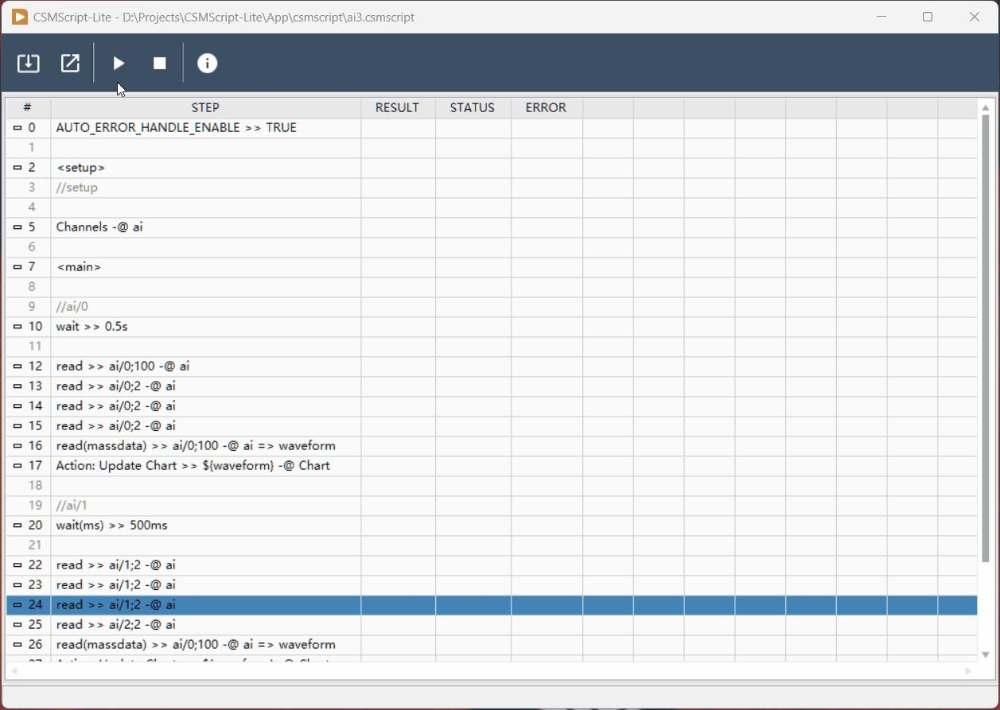

> 本文整理自知乎专栏原文，并按站点文档风格进行结构化排版。
> [原文链接](https://zhuanlan.zhihu.com/p/2027154035292083978)

CSMScript-Lite 是一个基于 CSM 的轻量级脚本执行引擎，目标不是另造一套自动化框架，而是把已有的 CSM 模块能力收拢到脚本层做编排，用更低的成本组织测试流程、示例流程和可重复执行的任务。

相关链接：

- [项目仓库](https://github.com/NEVSTOP-LAB/CSMScript-Lite)
- [CSM 框架](https://github.com/NEVSTOP-LAB/Communicable-State-Machine)

## 项目定位

原文把 CSMScript-Lite 定义为一款“类似 NI TestStand 的轻量脚本执行引擎”。它的核心价值主要在两点：

- 为 CSM 模块提供统一的脚本化调度入口。
- 用一个可读、可维护的文本层来表达自动化测试流程。

这意味着，如果底层模块已经按 CSM 标准接口组织好，脚本层就可以专注于“执行顺序、条件跳转、错误处理、返回值传递”这些流程问题，而不是重新把逻辑散落回界面代码里。

## 项目组成与依赖

项目当前主要包括：

- `CSMScript-Lite Library`：脚本解析与执行引擎，本身也是一个基于 CSM 的模块。
- 实例工程：展示如何把 CSMScript-Lite 与其他 CSM 模块组合起来，形成脚本驱动的自动化测试应用。

依赖方面，原文明确提到：

- LabVIEW 2020 及以上版本。
- [Communicable State Machine Framework 2026Q1](https://github.com/topics/labview-csm)。



## 关键能力

### 1. 执行标准 CSM 指令

CSMScript-Lite 支持常见的 CSM 指令形态，包括同步消息、异步消息和广播订阅等。对于已经采用 CSM 的系统来说，这一点很关键，因为脚本层不需要重新定义一套新的接口语义。

### 2. 返回值传递

脚本可以通过 `=> 变量名` 保存某一步执行结果，并在后续步骤中继续引用：

```text
message1 >> arguments -@ module1 => returnValueVar
message2 >> ${returnValueVar} -@ module2
```

这种写法的价值在于把“前一步结果驱动后一步行为”的链式关系明确写到脚本里，避免把临时状态分散到多个模块或界面变量中。

### 3. 扩展指令

除了标准 CSM 指令外，CSMScript 还内置了一组扩展指令，继续沿用 `指令 >> 参数` 的表达方式：

- `GOTO`：跳转到指定锚点。
- `AUTO_ERROR_HANDLE_ENABLE`：开启或关闭自动错误处理。
- `AUTO_ERROR_HANDLE_ANCHOR`：设置默认错误跳转锚点。
- `WAIT` / `Sleep`：支持混合时间表达式，例如 `1min 20s 500ms`。
- `WAIT(s)` / `WAIT(ms)`：分别按秒或毫秒精确等待。

示例：

```text
message1 >> arguments -@ csm
wait >> 1min 20s 500ms

message1 >> arguments -@ csm
wait(ms) >> 100

message1 >> arguments -@ csm
wait(s) >> 1.5
```

## 锚点与自动错误处理

脚本中可以定义命名锚点，例如 `<setup>`、`<main>`、`<error_handler>`、`<cleanup>`，再结合显式跳转或自动错误处理来组织流程阶段。

原文给出的典型示例可以概括为：

```text
AUTO_ERROR_HANDLE_ENABLE >> TRUE
AUTO_ERROR_HANDLE_ANCHOR >> error_handler

<setup>
initialize >> daq1 -@ ai ?? goto >> <cleanup>

<main>
configure >> Onboard Clock;10,-10,RSE -@ ai
start -@ ai
acquire >> Channel:ch0;Num:1000 -@ ai

<error_handler>
stop -@ ai

<cleanup>
close -@ ai
```

这类写法的优势在于：

- 把脚本分成清晰的阶段块。
- 把异常路径从主流程中拆出来单独表达。
- 让错误恢复行为可以复用，而不是散落在每一条指令旁边。

## 适合的使用场景

从原文的定位来看，CSMScript-Lite 更适合下面这类场景：

- 自动化测试流程编排。
- 教学或示例工程中的流程演示。
- 已有 CSM 模块体系上的快速脚本化集成。
- 希望把流程逻辑与底层模块实现解耦的项目。

## 小结

CSMScript-Lite 的意义不只是“把几条消息写成脚本”，而是让 CSM 的模块化能力在自动化流程层也保持同样的可读性与可组合性。对于需要持续演进的测试和流程系统，这种分层方式通常会比把逻辑堆在单个 VI 里更稳。

原文最后还提到，后续还会有 full 版本。如果你在使用类似方案，也可以反过来思考：在更完整的版本里，还需要哪些断言、流程控制、报告或调试能力。
