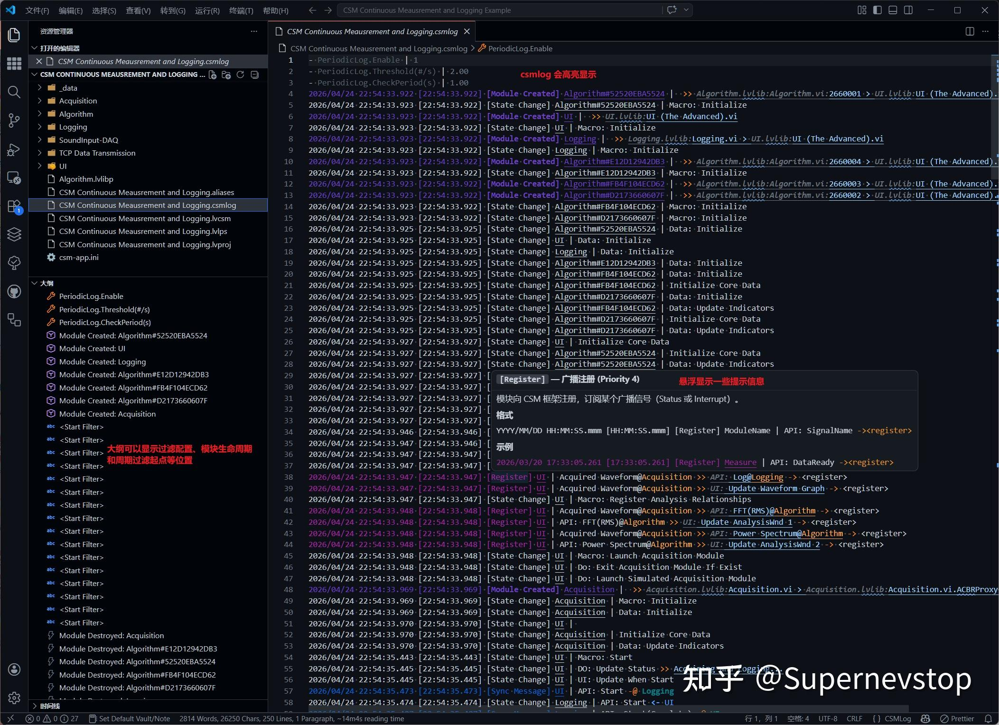

> 本文整理自知乎专栏原文，并按站点文档风格进行结构化排版。
> [原文链接](https://zhuanlan.zhihu.com/p/2031144461749760667)

如果你正在用 VSCode 查看 CSM 相关文件，这个扩展的价值并不只是“补一个语法高亮”，而是把日志阅读、配置检查和问题定位这些高频动作收敛到一个更顺手的编辑体验里。

## 项目简介

当前版本的扩展主要面向两类文件：

- `.csmlog`：CSM 日志文件，提供语法高亮、悬停提示与大纲支持。
- `.lvcsm`：CSM 配置文件，基于 INI 语法高亮规则做定制化支持。

相关链接：

- [项目仓库](https://github.com/NEVSTOP-LAB/csm-vsc-extension)

## 安装方式

- 需要 Visual Studio Code 1.60.0 或更高版本。
- 在扩展市场中搜索 `CSM` 即可安装。

## `.csmlog` 文件支持

针对日志文件，扩展当前提供的能力包括：

- 事件类型高亮，例如 `Error`、`User Log`、`Sync/Async Message`、`State Change` 等。
- 时间戳与模块名高亮，便于快速扫读一段日志。
- 参数 `key:` 前缀高亮，突出关键信息字段。
- Hover 悬停提示，覆盖事件类型、时间戳、配置键和部分操作符。
- Outline 大纲，支持快速定位配置项、`Module Created/Destroyed` 和 Logger 系统消息。
- 默认字号配置为 `14px`，也可通过 `editor.fontSize` 覆盖。
- 默认开启 `files.autoGuessEncoding`，降低 GBK/GB2312 文件乱码风险。

## `.lvcsm` 文件支持

针对配置文件，当前支持集中在“让现有配置更好读、更少出错”：

- 注册独立语言 `lvcsm`。
- 通过 `source.ini` 复用 INI 高亮规则。
- 默认开启 `files.autoGuessEncoding`，降低中文环境下的编码识别问题。

## 适用场景

这类支持比较适合下面几种场景：

- 日常查看和分析 CSM 运行日志。
- 调整 `.lvcsm` 配置文件时，减少纯文本编辑带来的辨识成本。
- 在 VSCode 中配合 Git 管理配置与日志样例时，获得更清晰的阅读体验。

## 问题反馈

如遇到问题，可前往 GitHub Issues 反馈：

- [问题反馈](https://github.com/NEVSTOP-LAB/csm-vsc-extension/issues)
