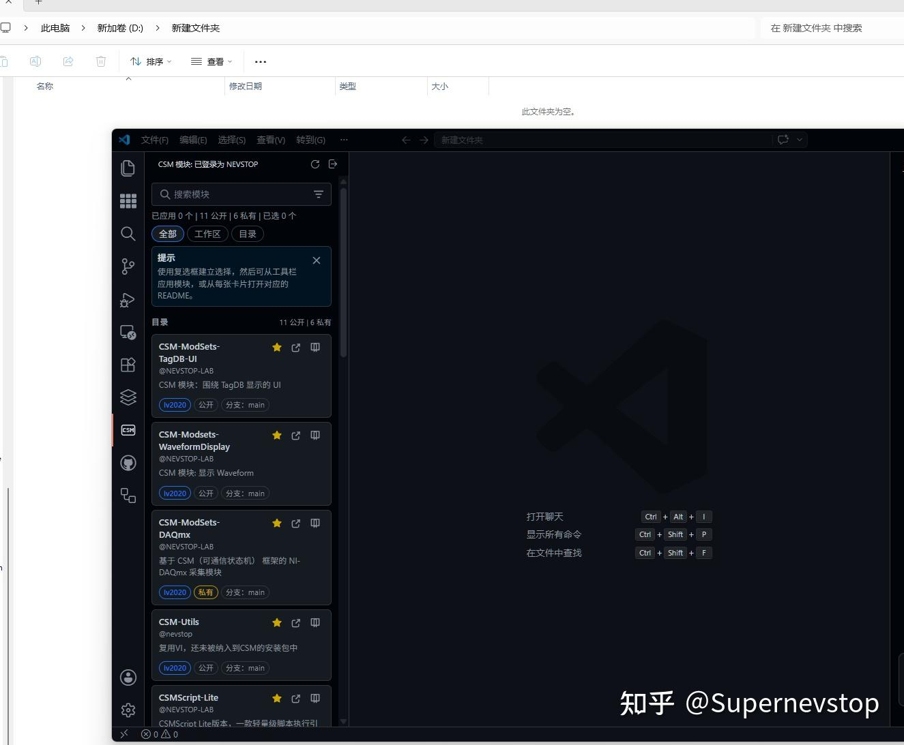
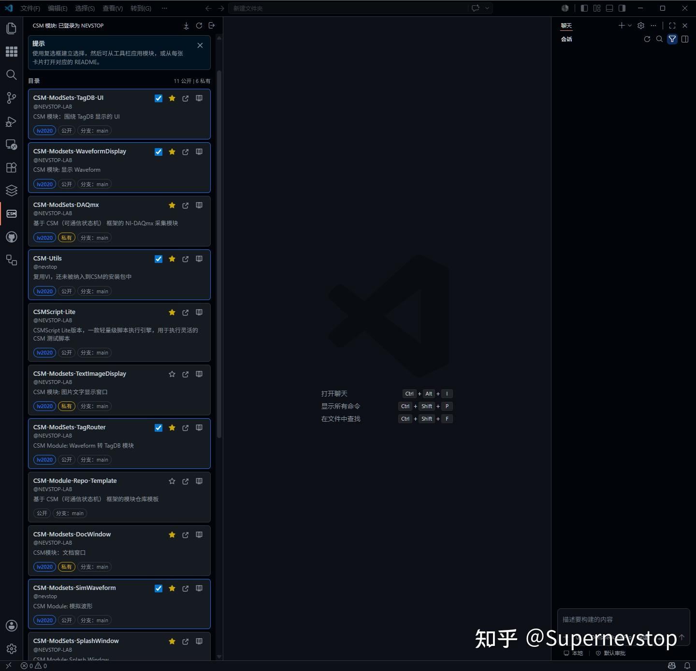
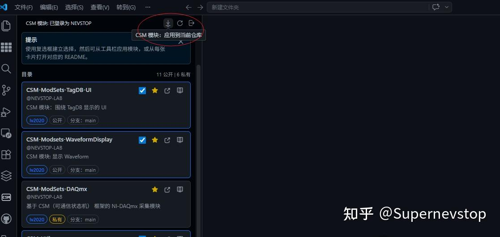
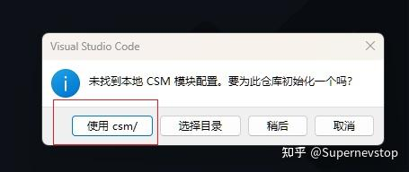
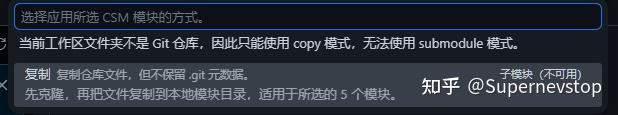
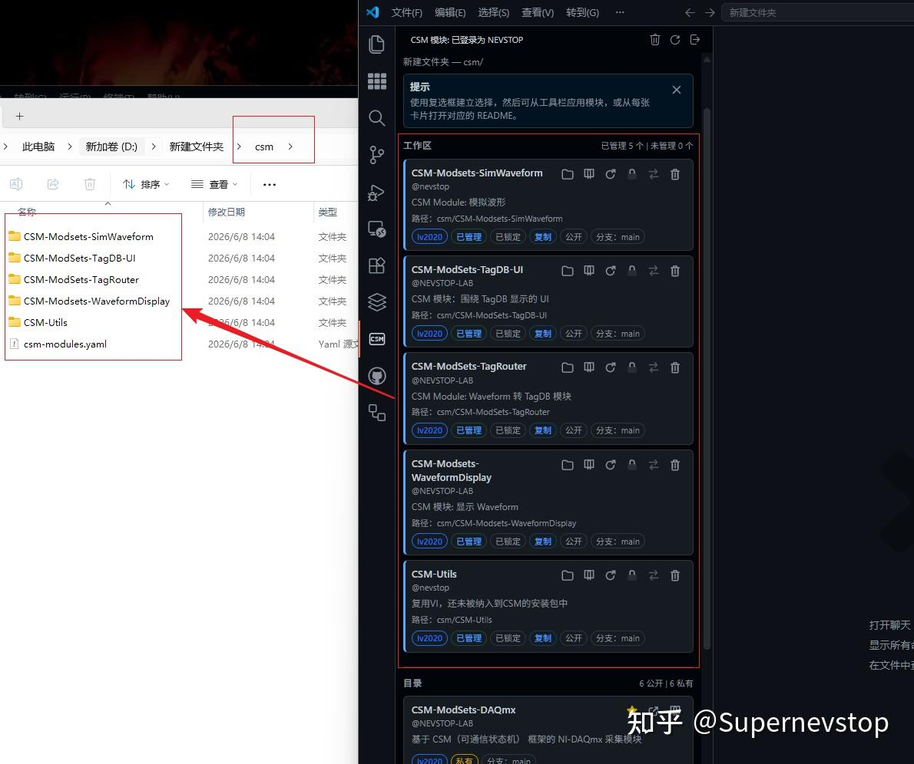
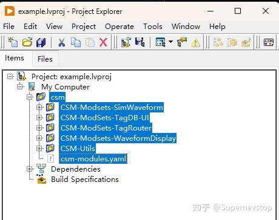
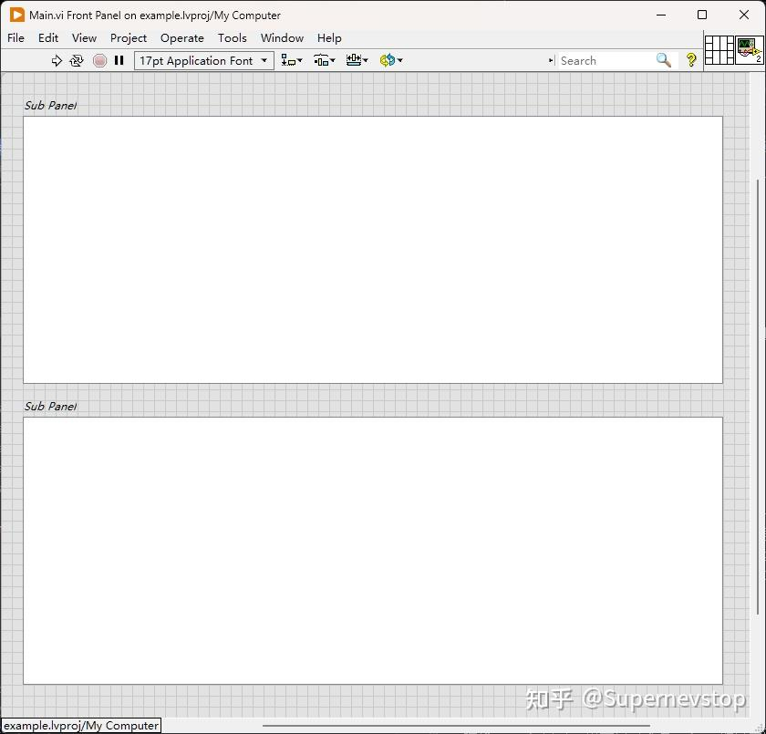
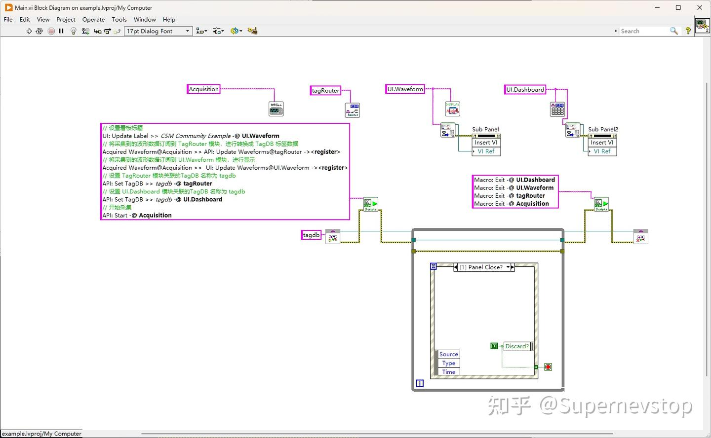
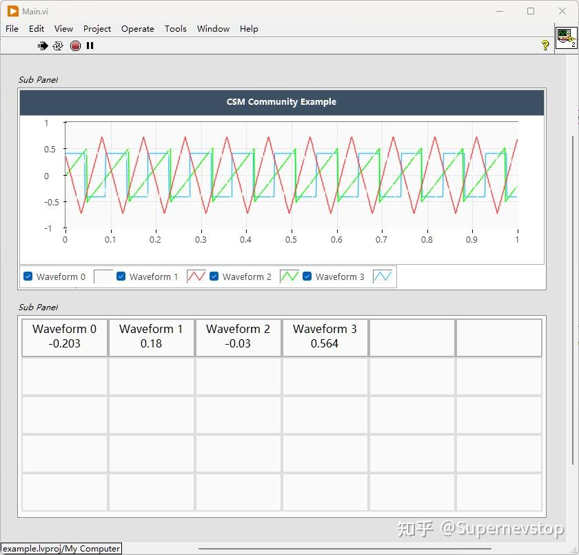

> 本文整理自知乎专栏原文，并按站点文档风格进行结构化排版。
> [原文链接](https://zhuanlan.zhihu.com/p/2047379175451971934)

在[上一篇文章](/blog/2026-06-04-csm-vscode-community-module-management/)中，我们介绍了 CSM VSCode 插件的模块管理功能——像「应用商店」一样浏览、发现和复用 CSM 模块。那篇文章侧重于功能介绍与设计理念，本文则是一篇**实操指南**：通过一个完整的波形数据采集与展示示例，带你一步步走通从「发现模块」到「项目跑起来」的全过程。

本文内容基于 [csm-community-example](https://github.com/NEVSTOP-LAB/csm-community-example) 仓库精简而来。该示例项目会持续更新，用于演示和测试 CSM-VSCode 插件的各项能力，欢迎大家 star 和关注。

## 背景与需求

通过以下流程，你可以快速利用 [CSM VSCode 插件](https://zhuanlan.zhihu.com/p/2046261986351231616) 拉取社区中已有的 CSM 模块，搭建一个简单的波形数据采集与展示系统。将需求分解到模块需求如下：

- **数据采集模块**：负责从硬件设备中采集波形数据。
- **数据处理模块**：分析波形数据的特征，提取有用信息（如峰值、频率等）。
- **数据显示模块**：将处理后的数据以波形图和看板的形式展示在界面上。

> 为简化演示，数据采集模块暂用模拟数据代替实际硬件采集，后续可根据需要替换为同接口的真实采集模块。

## Step 1：环境配置

### 1.1 安装依赖

在开始之前，请确保已安装以下工具：

- **VSCode**：微软的编辑器，AI 时代最佳编辑器之一。在扩展市场中搜索并安装 **CSM VSCode 插件**。
- **Git**：版本管理工具，用于模块的 clone 和 submodule 管理。
- **GitHub 账号**（可选）：注册 GitHub 账号，用于登录 VSCode 和 CSM VSCode 插件，解锁私有仓库访问。

### 1.2 VIPM 安装

通过 VIPM 安装以下 LabVIEW 依赖包：

| 包名 | 说明 |
|------|------|
| [CSM Libraries](https://www.vipm.io/?q=CSM+Libraries) | CSM 框架核心库，以 CSM 为关键字搜索即可 |
| [NEVSTOP-Programming-Palette](https://www.vipm.io/package/nevstop_programming_palette/) | NEVSTOP-LAB 复用 VI 集 |
| [LAVA UI Tool](https://www.vipm.io/package/lava_lib_ui_tools/) | LAVA 的界面辅助 VI（或安装 [NEVSTOP-3rdParty-Dependencies](https://www.vipm.io/package/nevstop_3rdparty_dependencies/)） |
| [TagDB](https://www.vipm.io/package/nevstop_tagdb_library/) | 标签数据库 |

## Step 2：CSM VSCode 插件选择并导入已有模块

### 2.1 准备工作

新建一个空文件夹，并使用 VS Code 打开该文件夹。



### 2.2 选择所需模块

根据上述需求，选择以下 CSM 模块来对应各功能：

> 💠 使用 GitHub 登录后，可以看到自己的私有仓库

| 模块 | 功能说明 |
|------|----------|
| CSM-Modsets-SimWaveform | 模拟波形数据采集模块 |
| CSM-Modsets-WaveformDisplay | 波形数据展示模块 |
| CSM-Modsets-TagRouter | 波形数据转换为 TagDB 标签数据模块 |
| CSM-Modsets-TagDB-UI | 标签数据库 UI 模块（看板展示） |



### 2.3 将模块导入到本地

点击「应用到本地」按钮：



选择 `csm/` 目录作为目标路径。由于当前目录不是 Git 仓库，无法使用 [submodule 模式](https://git-scm.com/book/zh/v2/Git-%E5%B7%A5%E5%85%B7-%E5%AD%90%E6%A8%A1%E5%9D%97)，请选择直接复制到本地的方式导入：

> 💠 如果本地文件夹是一个 Git 仓库，你还可以使用 submodule 模式，使用 Git 的 submodule 功能跟踪模块。






导入完成后，所选模块将被复制到本地 `csm/` 目录下：



> 💠 默认下载完毕后，为了避免误修改，所有的模块都被修改为只读模式。你可以点击模块卡片上的「解锁」按钮，将模块中的文件属性修改为可读写，然后修改模块功能。
>
> 💠 应用模块到本地，在 GitHub 登录的情况下，会默认 star 对应的 repo，这是对开源作者的鼓励。

## Step 3：在 LabVIEW 中创建项目

### 3.1 创建项目文件

使用 LabVIEW 新建一个项目，命名为 `Example.lvproj`。将 `csm/` 目录添加为项目的自动发布（Auto-populating）目录：



### 3.2 设计主界面（Main.vi）

创建一个 `Main.vi` 作为项目的主 VI。在前面板上放置两个 Subpanel 控件，分别用于嵌入波形显示界面和看板界面：



### 3.3 编写程序框图

按照以下步骤完成程序框图的搭建：

- **放置 CSM 模块**：将所需的 CSM 模块 VI 拖入程序框图，并分别命名为 `Acquisition`、`TagRouter`、`UI.Waveform`、`UI.Dashboard`。
- **获取模块前面板引用**：通过 `CSM - Module VI Reference.vi` 分别获取 `UI.Waveform` 和 `UI.Dashboard` 模块的前面板引用，再利用 Subpanel 的属性节点（`Insert VI` 方法）将两个模块依次嵌入到对应的 Subpanel 控件中。
- **创建主循环**：创建一个带事件结构的 `While` 循环，监听「前面板关闭」事件（点击窗口 X 按钮时触发），在事件分支中退出循环。
- **创建共享资源**：根据模块需求，创建一个 TagDB Refnum，供 TagRouter 和 UI.Dashboard 模块共享使用。
- **编写启动脚本**：在程序启动时执行以下 CSM 脚本，完成模块间的数据路由与初始配置：

```csm
// 设置波形显示界面的标题
"UI: Update Label >> CSM Community Example -@ UI.Waveform

// 将采集到的波形数据订阅到 TagRouter 模块，由其转换为 TagDB 标签数据
"Acquired Waveform@Acquisition >> API: Update Waveforms@TagRouter -><register>

// 将采集到的波形数据订阅到 UI.Waveform 模块，进行实时波形显示
"Acquired Waveform@Acquisition >> UI: Update Waveforms@UI.Waveform -><register>

// 设置 TagRouter 模块关联的 TagDB 名称
"API: Set TagDB >> tagdb -@ TagRouter

// 设置 UI.Dashboard 模块关联的 TagDB 名称
"API: Set TagDB >> tagdb -@ UI.Dashboard

// 启动数据采集
"API: Start -@ Acquisition
```

- **程序退出清理**：在程序退出时，向所有模块发送 `"Macro: Exit"` 命令，确保各模块正确释放资源并退出。

后面板（程序框图）结构如下图所示：



### 3.4 运行效果

程序运行后，界面如下所示：



## 常见问题答疑

### Q1：LabVIEW 版本与模块版本不一致怎么办？

当 LabVIEW 版本高于模块开发版本时，建议使用 Copy 模式将模块复制到本地，LabVIEW 会自动进行版本迁移，高版本通常可以正常打开。后续计划支持 `lvlibp`（打包库）方式发布，以解决版本依赖问题。

### Q2：如何查看模块提供的接口？

推荐使用 `CSM Interface Browser.vi` 工具查看任意模块的对外接口。对于符合标准的模块，可进一步参考 [CSM-Module-Repo-Template](https://github.com/NEVSTOP-LAB/CSM-Module-Repo-Template) 中定义的接口规范文档。遵循统一规范后，未来可利用预制脚本或 AI 自动生成 CSM Script 与模块配置信息（规划中的功能）。

### Q3：csm-community-example 相比基础用法多了哪些内容？

本示例在基础用法之上额外演示了以下可选功能：

- 使用 SplashWindow 模块优化程序启动加载过程；
- 使用 CSM-Utils 工具集中的 VI 简化开发流程；
- 使用 VS Code 编辑和管理配置文件。

以上均为可选增强功能，本文聚焦基础用法，帮助用户快速掌握 CSM-VSCode 插件的核心模块管理能力。

### Q4：模块的 LabVIEW 依赖如何解决？

目前插件并不能自动解析模块间的依赖关系，之后会通过支持 `lvlibp`（打包库）和定义依赖关系文件的方式，补充插件的依赖管理能力。当前建议用户在导入模块前，先查看模块的 README 文档，确认是否有其他依赖模块需要一并导入。

---

欢迎试用，以 issue 的方式提交对该功能的功能需求。 :)
