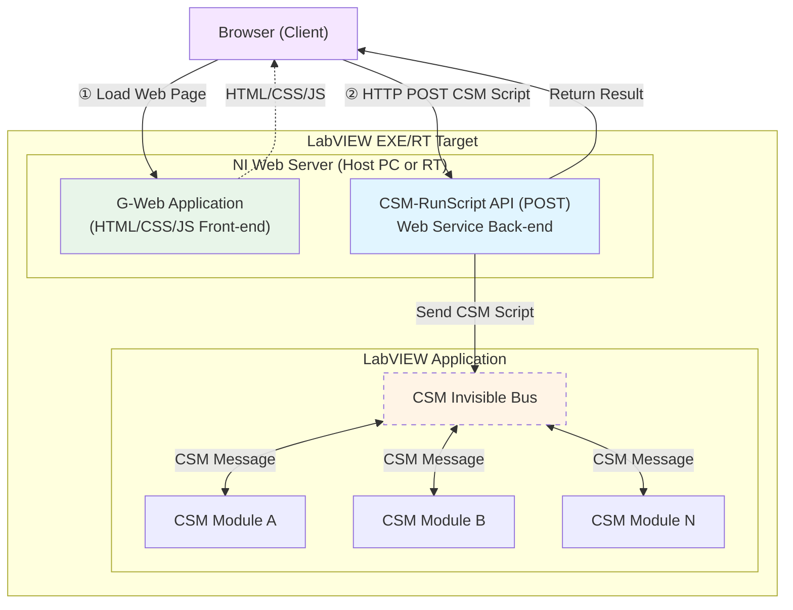

> 自动同步来源： [NEVSTOP-LAB/G-Web-Development-with-CSM](https://github.com/NEVSTOP-LAB/G-Web-Development-with-CSM)
> 导入规则：仅根据 README 是否包含中文判断，正文保持原文。

# G-Web Development with CSM

[English](./README.md) | [中文](./README(CN).md)

This project uses the CSM framework to publish LabVIEW applications as Web Services, enabling remote monitoring and control through a G-Web front-end in the browser. By exposing just **one** `CSM-RunScript` endpoint, all functionality of every CSM module in the back end becomes accessible — no need to write a separate Web Service VI for each feature.

Ideal for NI cRIO/PXI and other RT targets — users access the device over the local network directly from a browser with no client software required.

> Full documentation: [CSM-Wiki - G-Web Application Development](https://nevstop-lab.github.io/CSM-Wiki/docs/examples/csm-gweb-development.html)

## System Architecture



## Key Advantages

- **Single endpoint, full functionality**: Expose only one `CSM-RunScript` endpoint to access all features of every CSM module in the back end.
- **Modular development**: Message-driven architecture based on the CSM framework — loosely coupled modules that are easy to extend and maintain.
- **No client required**: Users access the application directly from a browser with no client software installation needed.
- **Rapid web enablement**: Quickly convert an existing LabVIEW application into a web application without writing a separate Web Service for each feature.
- **Embedded deployment friendly**: Especially suited for deployment on cRIO, PXI, and other RT targets for remote monitoring and control.

## Project Structure

```text
G-Web-Development-with-CSM/
├── LabVIEW Project with Web Serivces/   # LabVIEW back-end project
│   ├── LabVIEW Project with Web Serivces.lvproj
│   ├── Test WebService.vi               # Web Service test VI
│   └── WebService/
│       ├── CSM WebService.lvlib         # Web Service library
│       ├── Startup Main.vi              # Application entry point
│       ├── Methods/
│       │   └── CSM-RunScript.vi         # The single Web Service endpoint
│       ├── CSM/
│       │   └── CSM.vi                   # CSM application main module
│       └── Support/                     # Support VIs
└── G-Web Application/                   # G-Web front-end project (NI LabVIEW NXG Web Module)
    └── Web Application/                 # Deployable web application (.gwebproject)
```

## CSM-RunScript Endpoint

| Item | Description |
| --- | --- |
| Method | `POST` |
| URL | `http://<host>:<port>/CSMWebService/CSM-RunScript` |
| Request body | CSM script string (plain text) |
| Response | Execution result string (plain text) |

```
# Synchronous call — waits for the result
API: Read >> channel0 -@ SomeModule

# Asynchronous call — does not wait for the result
API: Start ->| SomeModule
```

## Quick Start

1. **Build your CSM application**: Implement your business-logic modules in LabVIEW using the CSM framework.
2. **Open the back-end project**: Open `LabVIEW Project with Web Serivces/LabVIEW Project with Web Serivces.lvproj` in LabVIEW and add or modify business modules inside `WebService/CSM/CSM.vi`.
3. **Open the front-end project**: Open `G-Web Application/Web Application/Web Application.gwebproject` in NI LabVIEW NXG Web Module and configure the HTTP node to point to the `CSM-RunScript` endpoint.
4. **Deploy and run**: Right-click the Web Service → **Deploy**, or run `WebService/Startup Main.vi` directly; build the G-Web application and publish it to the NI Web Server.
5. **Access from browser**: `http://<device-IP>:<port>/CSMWebService/`

## Dependencies

- [Communicable State Machine (CSM)](https://github.com/NEVSTOP-LAB/Communicable-State-Machine)
- [LabVIEW Application Web Server](https://www.ni.com/docs/en-US/bundle/labview/page/webservices.html)
- [NI LabVIEW NXG Web Module](https://www.ni.com/en/support/downloads/software-products/download.labview-nxg-web-module.html)

## References

- [CSM-Wiki - G-Web Application Development](https://nevstop-lab.github.io/CSM-Wiki/docs/examples/csm-gweb-development.html)
- [Communicable State Machine (CSM) Framework](https://github.com/NEVSTOP-LAB/Communicable-State-Machine)
- [LabVIEW Web Services Official Documentation](https://www.ni.com/docs/en-US/bundle/labview/page/webservices.html)

